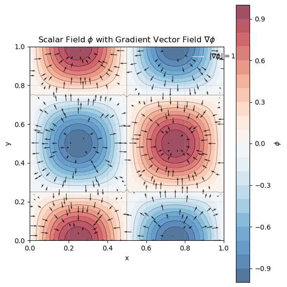

# Calculate the spatial gradient of a scalar field on the mesh

FELiCS can be used to calculate the spatial gradient of a quantity with a few commands. Here, the following cases are described:
- cartesian coordinates: square 2D domain
- cartesian coordinates with spectral dimension: the de-facto 2D domain can be imagined as a 3D channel, which is periodically expanded in the third direction
- cylindrical coordinates with symmetry axis: the domain has a symmetry boundary condition
- cylindrical coodinaates with spectral dimension: the domain can be imagined as a pipe

### Cartesian coordinates on a 2D domain
Here, the gradient of a scalar field on a square 2D mesh is computed. We define our scalar field as follows:
$$\phi(x,y) = \sin(2\pi x)\cos(2\pi y)$$


**Step 1: Create FELiCSMesh, FELiCSSpace and Field**


```python
from FELiCS.SpaceDisc.FELiCSMesh import FELiCSMesh
from FELiCS.SpaceDisc.FEMSpaces  import getFELiCSSpace
from FELiCS.Fields.Field         import Field

meshFileName = "./square_mesh.msh"
coordinateSystemName = "Cartesian"

# create a FELiCS mesh from the gmsh file
mesh = FELiCSMesh(coordinateSystemName=coordinateSystemName, meshFileName=meshFileName)

# create a scalar space
scalarSpace = getFELiCSSpace(mesh, order=2, dim=1)

# create a Field object and import the data from the h5 file
phi = Field(scalarSpace, mesh=mesh) 
phi.importH5("function_values_sine")

```

    Info     | FELiCSMesh.py          | __init__                   (line 78  ) : Opening mesh file: ./square_mesh.msh
    Info     | FELiCSMesh.py          | __init__                   (line 86  ) : Mesh contains 513 nodes and 1024 elements


**Step 2: Get gradient as a vector field and extract the scalar fields**

We now want to calculate the gradient of our scalar quantity using the `getGradientField()` method of our Field class. This method returns a Field object, which represents a vector-field as we calculate the gradient of a scalar with respect to our two spatial and one spectral dimension. The gradient is defined as
$$\nabla \phi = \left(\frac{\partial \phi}{\partial x}, \frac{\partial \phi}{\partial y}\right)\ .$$
So for our function the analytical gradient is
$$\nabla \phi = \begin{pmatrix}
2\pi \cos(2\pi x) \cos(2\pi y) \\
-2\pi \sin(2\pi x) \sin(2\pi y) 
\end{pmatrix}\ .$$ 
The resulting field is defined on a vector space with 2 dimension. We can also transform it in two scalar fields via the command 'getListOfSingleFields()'.


```python
gradPhi = phi.getGradientField() # this is a vector field

# get scalar fields from gradient:
gradList = gradPhi.getListOfSingleFields()
phi_x    = gradList[0]
phi_y    = gradList[1]
```

Now, we verify our solution with the analytically obtained gradient:


```python
# create a vector field
vectorSpace = getFELiCSSpace(mesh, order=2, dim=2)
gradPhiSol = Field(vectorSpace, mesh=mesh)
gradPhiSol.importH5("grad_solution")
print("Error: ", sum(gradPhi.getCoefficientArray() - gradPhiSol.getCoefficientArray()))
```

    Error:  (-0.14875251731077316+0j)


**Step 3: Postprocessing**

Visualization of the gradients with matplotlib:


```python
import matplotlib.pyplot as plt
import numpy as np
from matplotlib.tri import Triangulation

# Get DOF coordinates for both scalar and vector spaces
scalar_dof_coords = scalarSpace.tabulate_dof_coordinates()
vector_dof_coords = vectorSpace.tabulate_dof_coordinates()

# Get the field values
phi_values = phi.getCoefficientArray()
gradPhi_x = np.real(phi_x.getCoefficientArray())
gradPhi_y = np.real(phi_y.getCoefficientArray())

# Extract x and y coordinates
x_scalar = scalar_dof_coords[:, 0]
y_scalar = scalar_dof_coords[:, 1]
x_vector = vector_dof_coords[:, 0]
y_vector = vector_dof_coords[:, 1]

# Extract gradient components (real parts for visualization)
# For vector space with dim=3, we have [grad_x, grad_y, grad_z] components
n_dofs = len(vector_dof_coords)

# Create triangulation for contour plot
triang_scalar = Triangulation(x_scalar, y_scalar)

# Create the plot
fig, ax = plt.subplots(1, 1, figsize=(6, 6))

# Create contour plot of phi
contour = ax.tricontourf(triang_scalar, np.real(phi_values), levels=20, cmap='RdBu_r', alpha=0.7)
contour_lines = ax.tricontour(triang_scalar, np.real(phi_values), levels=10, colors='black', alpha=0.5, linewidths=0.5)

# Add colorbar for phi
cbar = plt.colorbar(contour, ax=ax, label=r'$\phi$')

# Add quiver plot of gradient (subsample for clarity)
skip = 5  # Show every 5th vector to avoid overcrowding
quiver = ax.quiver(x_vector[::skip], y_vector[::skip], 
                   gradPhi_x[::skip], gradPhi_y[::skip], 
                   scale=150, alpha=0.8, color='black', width=0.003)

# Add a reference arrow
ax.quiverkey(quiver, 0.9, 0.95, 10, r'$|\nabla\phi| = 10$', 
             labelpos='E', coordinates='axes', color='white')

# Set labels and title
ax.set_xlabel('x')
ax.set_ylabel('y')
ax.set_title(r'Scalar Field $\phi$ with Gradient Vector Field $\nabla\phi$')
ax.set_aspect('equal')
ax.grid(True, alpha=0.3)

plt.tight_layout()
plt.show()
```


    

    


### Cartesian coordinates with spectral dimension
Here, to the two spatial dimensions (x and y) a third spectral dimension in z-direction is added.
With the spectral dimension the scalar field becomes
$$\phi \cdot e^{imz}$$
where m is the wave number. With the wave number we represent a periodicity of the flow in z-direction, while still only calculating a 2D flowfield.

**Step 1: Create FELiCSMesh, FELiCSSpace and Field**


```python
from FELiCS.SpaceDisc.FELiCSMesh import FELiCSMesh
from FELiCS.SpaceDisc.FEMSpaces  import getFELiCSSpace
from FELiCS.Fields.Field         import Field

meshFileName = "./square_mesh.msh"
coordinateSystemName = "Cartesian"
m = 3

# create a FELiCS mesh from the gmsh file
mesh = FELiCSMesh(coordinateSystemName=coordinateSystemName, meshFileName=meshFileName)

# create a scalar space
scalarSpace = getFELiCSSpace(mesh, order=2, dim=1)

# create a Field object and import the data from the h5 file
phi = Field(scalarSpace, mesh=mesh, m = m) # by setting m to an integer number, the spectral direction is added
phi.importH5("function_values_sine")

```

    Info     | FELiCSMesh.py          | __init__                   (line 78  ) : Opening mesh file: ./square_mesh.msh
    Info     | FELiCSMesh.py          | __init__                   (line 86  ) : Mesh contains 513 nodes and 1024 elements


**Step 2: Define the gradient Expression and evaluate it on the Field**

With the spectral dimension, the gradient is now 3-dimensional:
$$\nabla \phi = \left(\frac{\partial \phi}{\partial x}, \frac{\partial \phi}{\partial y}, \frac{\partial \phi}{\partial z}\right)$$
and it is defined as:
$$\nabla \phi = \begin{pmatrix}
2\pi \cos(2\pi x) \cos(2\pi y) \cdot e^{imz} \\
-2\pi \sin(2\pi x) \sin(2\pi y) \cdot e^{imz} \\
im \sin(2\pi x) \cos(2\pi y) \cdot e^{imz}
\end{pmatrix}\ .$$
Note that the derivative in the spectral dimension is imaginary. 
The obtained gradient is a 3-dimemsional vector field:


```python
gradPhi = phi.getGradientField() # this is a vector field

# get scalar fields from gradient:
gradList = gradPhi.getListOfSingleFields()
phi_x    = gradList[0]
phi_y    = gradList[1]
phi_z    = gradList[2]
```

Again, we verify our solution with the analytically obtained gradient:


```python
vectorSpace = getFELiCSSpace(mesh, order=2, dim=3)
gradPhiSol = Field(vectorSpace, mesh=mesh)
gradPhiSol.importH5("grad_solution_cylSpectral_m=3")
print("Error: ", sum(gradPhi.getCoefficientArray() - gradPhiSol.getCoefficientArray()))
```

    Error:  (-0.14875251730587813+122.23235562363332j)


**TODO: remove this part after validation is done**


```python
import numpy as np

gradPhi = phi.getGradientField()

# Calculate analytical solution
def test_function_2(x):
    """Sine wave function: f(x,y) = sin(2*pi*x) * cos(2*pi*y)"""
    return np.sin(2 * np.pi * x[0]) * np.cos(2 * np.pi * x[1])

def dtest_dx(x):
    """Derivative of the sine wave function with respect to x: df/dx = 2*pi*cos(2*pi*x)*cos(2*pi*y)"""
    return 2 * np.pi * np.cos(2 * np.pi * x[0]) * np.cos(2 * np.pi * x[1])

def dtest_dy(x):
    """Derivative of the sine wave function with respect to y: df/dy = -2*pi*sin(2*pi*x)*sin(2*pi*y)"""
    return -2 * np.pi * np.sin(2 * np.pi * x[0]) * np.sin(2 * np.pi * x[1])

# Calculate function values at DOF coordinates
dof_coordinates = vectorSpace.tabulate_dof_coordinates()

function_values_1 = np.zeros(len(dof_coordinates))
function_values_2 = np.zeros(len(dof_coordinates))

for i, coord in enumerate(dof_coordinates):
    function_values_1[i] = dtest_dx(coord)
    function_values_2[i] = dtest_dy(coord)


print(sum(gradPhi.getCoefficientArray() - gradPhiSol.getCoefficientArray()))
```

    (-0.14875251731077316+0j)

