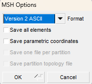

# Tutorial on Resolvent Analysis with FELICS

## Goal of the Tutorial

The goal of this tutorial is to provide a step-by-step guide on performing resolvent analysis in FELICS. By the end of this tutorial, you will be able to:

- Define a case for resolvent analysis.
- Create a case folder with a mesh and base flow files.
- Perform resolvent analysis.
- Postprocess and visualize the results.

## Case Definition

In this tutorial, we will perform incompressible resolvent analysis about the 2D mean flow in a constricted pipe (stenosis). For the geometry details, see Ref. [[1]](#1). The inlet has a steady boundary condition with a Reynolds number 8000 based on the diameter and veloocity in the contraction. 

### Mesh generation

We generate the 2D mesh on GMSH. 
To do so, we write a **.geo** file readable by GMSH using the python script [geoMesh.py](../../TUTORIALS/resolvent_tutorial/geoMesh.py).

Feel free to play with the `CellsFineness` factor to see the influence of finer meshes.

**Warning:** For 2D computations, FELiCS handles only triangular elements only.

Open the .geo file with GMSH. You should obtain this geometry:

CLick on "Mesh" and "2D". Export the mesh in File -> Export it in a **.msh** format. Make sur to use `Version 2 ASCII`.



Place this `FeliCS_mesh.msh` file in your case folder. 

### Base Flow

Our base flow is obtained by time-azimuthal-averaging the snapshots of a 3D LES. This could be a RANS solution, experimental data, or any other relevant flow field.
The following python script loads the data and write a **.fel** file.
Place this .fel file in your case folder. 

### Boundary conditions

Here we set the axisymmetric boundary conditions in the `boundaries.json` file.
Check in your readable .msh file the boundary ids.
For instance in this file: 
```bash
$MeshFormat
2.2 0 8
$EndMeshFormat
$PhysicalNames
5
1 2 "centerline"
1 3 "inlet"
1 4 "outlet"
1 5 "walls"
```
the IDs of "centerline", "inlet", "outlet", "walls" are respectively 2,3,4,5.

DEFINE THE BOUNDARIES WITH NEW METHOD?

## Resolvent parameters
The setting file contains all the analysis information. It should be placed in our 
An example of setting file is [resolvent_setting.json](https://git.tu-berlin.de/laboratory-for-flow-instabilities-and-dynamics/felics2.0/-/blob/development/TUTORIALS/resolvent_tutorial/resolvent.json?ref_type=heads). The explanation of each field is provided in [Setting files](hhttps://git.tu-berlin.de/laboratory-for-flow-instabilities-and-dynamics/felics2.0/-/blob/development/DOCUMENTATION/Running_FELiCS/FELiCS_settings.md?ref_type=heads).

The azimuthal number is chosen:
```json
    "m":0.0,
```
We set the moecular viscosity to be the inverse of the Reynolds number since we non-dimensionalized the variables and equations.
```json
"MolVisc":0.000125,
```
You can increase this field in order to add a uniform eddy viscosity field. 
Care should be brought to consistency accross the normalization. 

We want to solve the Momentum and Mass equations only and set the others to `"None"`

If we wish to include a turbulent viscolity fields, we should be set:
```json
    {"TurbulenceModel":"File"}
```
The frequencies for which we compute the resolvent modes are provided in the field: 
```json
    {"Omegas":[0.1,0.2,0.3,0.4,0.5,0.6,0.7,0.8,0.9]}
```
Complexe frequencies can also be solved using the string format: 
```json
    {"Omegas":["1.0-1j", "1.0+1j"]}
```
We can vary the number of resolvent modes that we want to compute with the field:
```json
    {"nSolut": 3}
```
**NOTE:** The following fields are not relevent for the resolvent analysis:
```json
{"CalculateAdjoint", "EigenValueGuess"}
```
## Running the analysis
Your case folder should look like:
```bash
.
├ FeliCS_mesh.msh
├ meanFlow.fel
├ resolvent_setting.json
├ boundaries.json
├ mixture.json
└── output_dir
```
Run the analysis with the command: 
```bash
FELiCS -file resolvent_setting.json
```
## Postprocessing
After the computation, check the `output_dir/`. You should find these files: 
```bash
└── output_dir
    ├ meanflow.h5
    ├ Resolvent_mesh.h5
    ├ gains.csv
    ├ Resolvent_Omega3.1_Forcing_gain0.xmf
    ├ Resolvent_Omega3.1_Forcing_gain0.h5
    ├ Resolvent_Omega3.1_Response_gain0.xmf
    ├ Resolvent_Omega3.1_Response_gain0.h5
```
After solving several frequencies, you can plot the gains against the Strouhal number using the python script [postProd_gains.py](../../TUTORIALS/resolvent_tutorial/postProd_gains.py). 

To visualize the mode shape, open the file `Resolvent_Omega3.1_Response_gain0.xmf` with Paraview. 
>**Warning:** The gains provided by FELiCS are $sigma^2$. The forcing modes have a unitary norm on the defined forcing domain, but the response modes have the norm $sigma$ on the defined response domain.

## References
<a id="1">[1]</a> 

Villié, A., Schmitter, S., von Saldern, J. G., Demange, S., & Oberleithner, K. . “Physics-informed neural networks for enhancing medical flow magnetic resonance imaging: Artifact correction and mean pressure and Reynolds stresses assimilation”. In: JPhysics of Fluids 37(2) (Jan. 2025). issn: 1089-7666. doi: 10.1063/5.0252852. url: https://pubs.aip.org/aip/pof/article-abstract/37/2/025194/3336391/Physics-informed-neural-networks-for-enhancing?redirectedFrom=fulltext.
