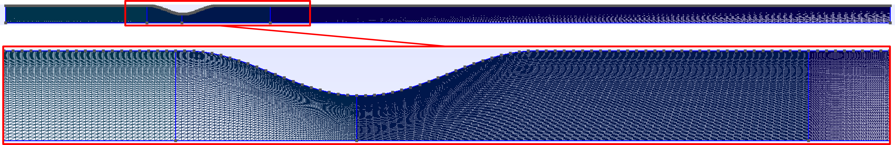
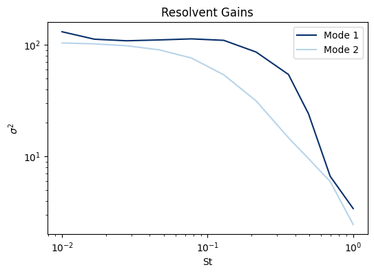
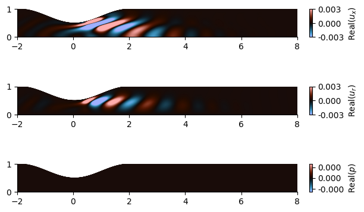
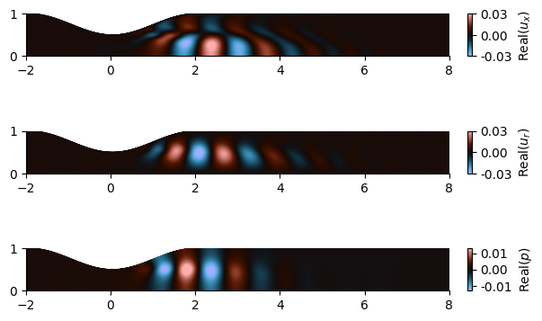

# Tutorial 3: Resolvent Analysis

## Goal of the Tutorial
The goal of this tutorial is to provide a step-by-step guide on performing resolvent analysis in FELiCS. By the end of this tutorial, you will be able to:

- Write a mesh file on GMSH using a python script.
- Import the mean flow data and create a mean flow file for FELiCS.
- Perform resolvent analysis for different frequencies.
- Plot the gains and mode shapes in Python.

The resolvent analysis provides insights into:
- (Dominant) amplification mechanisms of harmonic perturbations in the flow, quantified by a frequency dependent gain function
- In which flow region these amplification mechanisms are most efficiently triggered (optimal forcings mode)
- What it the response to a optimal forcing (optimal response mode)


The resolvent analysis will:
1. Identify frequencies and spatial regions where the flow is most sensitive to forcing.
2. Quantify the gain between input disturbances and flow response for each frequency.

## Case Definition
In this tutorial, we will perform incompressible resolvent analysis about the 2D mean flow in a constricted pipe (stenosis). For the geometry details, see Ref. [[1]](#1). The inlet has a steady inflow boundary condition with a Reynolds number of 8000 based on the diameter and bulk speed in the contraction. Since the mean flow is axisymmetric, the 3D solution is solved for a given azimuthal wavenumber.

### Mesh generation
We generate the 2D mesh on GMSH. 
To do so, we write a **.geo** file readable by GMSH using the python script [```geoMesh.py```](../../TUTORIALS/resolvent_tutorial/geoMesh.py).

Feel free to play with the `CellsFineness` factor to see the influence of finer meshes.

Open the .geo file with GMSH an click on 'Mesh -> 2D'. You should obtain this mesh:

Figure 1. Stenosis mesh
Export the mesh in `File -> Export` in a **.msh** format with `Version 2 ASCII`. Place this `FELiCS_mesh.msh` file in your case folder. 

### Base Flow
This tutorial case folder is located in ```felics2.0/TUTORIALS/resolvent_tutorial```.
Our base flow is obtained by time-azimuthal-averaging the snapshots of a 3D LES. Alternatively this could be a RANS solution, experimental data, or any other relevant flow field.
Run the python script [```meanFlow.py```](../../TUTORIALS/resolvent_tutorial/meanFlow.py) to load the mean flow data and write a **.fel** file. 
Change the `fold_path` to your data folder and run the script.
This script also allows to define response and forcing domains, a sponge function and an eddy viscosity field.
In our case, the response and forcing domains are the same, but we could restrict it to different regions. The sponge function is used to dampen the fluctuations near the inlet/outlet.

Place the ```meanFlow.fel``` file in your case folder. 

## Resolvent parameters

### Boundary conditions
Here, we set the axisymmetric boundary conditions in the [```boundaries.json```](../../TUTORIALS/resolvent_tutorial/boundaries.json) file.
First check in your readable .msh file the boundary ids.
For instance in this file: 
```bash
$MeshFormat
$PhysicalNames
5
1 2 "centerline"
1 3 "inlet"
1 4 "outlet"
1 5 "walls"
```
the IDs of "centerline", "inlet", "outlet", "walls" are respectively 2,3,4,5.

Define the boundaries in the file [boundaries.json](../../TUTORIALS/resolvent_tutorial/boundaries.json) using the corresponding IDs. The file structure is detailed in [Setting files](hhttps://git.tu-berlin.de/laboratory-for-flow-instabilities-and-dynamics/felics2.0/-/blob/development/DOCUMENTATION/Running_FELiCS/FELiCS_settings.md?ref_type=heads).
In our case, we set:
| Boundary | $u'_x$ | $u'_r$ | $u'_\theta$ | $p'$ |
|:----------|:-----------|:-----------|:-----------|:-----------|
| <code style="color : Darkorange">Symmetry</code> | Neumann   | Dirichlet  | Dirichlet | Dirichlet |
| <code style="color : Darkorange">Inlet</code> | Dirichlet | Dirichlet | Dirichlet | Dirichlet |
| <code style="color : Darkorange">Outlet</code> | Dirichlet | Dirichlet | Dirichlet | Dirichlet |
| <code style="color : Darkorange">Wall</code> | Dirichlet | Dirichlet | Dirichlet | Neumann |

### Settings
The setting file [```resolvent_settings.json```](../../TUTORIALS/resolvent_tutorial/resolvent_settings.json) contains all the analysis information. The explanation of each field is provided in [Setting files](hhttps://git.tu-berlin.de/laboratory-for-flow-instabilities-and-dynamics/felics2.0/-/blob/development/DOCUMENTATION/Running_FELiCS/FELiCS_settings.md?ref_type=heads).

Here are some key settings for our resolvent analysis:

- The coordinates system is set to Cylindrical: 
```json
{"CoordinateSystem": "Cylindrical",}
```
```{note}
The velocity components are thus refered to as `ux, ur, ut` instead of `ux, uy, uz`.
'''

- We choose to study axisymmetric perturbations by setting the azimuthal wavenumber to 0:
```json
    "m":0.0,
```
- Since we non-dimensionalized the state variables, equations and the mesh/cmoputational domain, we set the molecular viscosity $\nu$ to be the inverse of the Reynolds number:
```json
"MolVisc":0.000125,
```
    You can increase this field in order to add a uniform eddy viscosity field.Ensure consistency in the normalization approach throughout the analysis.

- We want to solve the ```Momentum``` and ```Mass``` equations only and set the other equations in <code style="color : Blue">"SetofEquations"</code> to `"None"`

- If we included a turbulent viscosity field in the ```meanFlow.py``` file, we should set:
```json
    {"TurbulenceModel":"File"}
```
- The frequencies for which we compute the resolvent modes are provided in the field: 
```json
    {"Omegas":[0.062, 0.10, 0.17, 0.29, 0.48, 0.81, 1.35, 2.26, 3.1, 4.36, 6.28]}
```
- We can vary the number of resolvent modes that we want to compute with the field:
```json
    {"nSolut": 2}
```
```{note}
The following fields `CalculateAdjoint` and `EigenValueGuess` are not relevent for the resolvent analysis.
```
## Running the analysis
Your case folder should look like:
```bash
.
├ FELiCS_mesh.msh
├ meanFlow.fel
├ resolvent_settings.json
├ boundaries.json
└ mixture.json
```
Run the analysis with the command:
```bash
FELiCS -f resolvent_settings.json
```
With the provided mesh, it should take about two minute to compute the two resolvent modes for each frequency (~25 minutes).
## Postprocessing
After the computation, the `output_dir/` has been created. You will find there the following files: 
```bash
.
└── output_dir
    ├ gains.csv
    ├ meanflow.h5
    ├ Resolvent_mesh.h5
    ├ Resolvent_Omega3.1_Forcing_gain0.xmf
    ├ Resolvent_Omega3.1_Forcing_gain0.h5
    ├ Resolvent_Omega3.1_Response_gain0.xmf
    ├ Resolvent_Omega3.1_Response_gain0.h5
    └ ...
```
We postprocess the outputed files using the python script [```PlotMode.py```](../../TUTORIALS/resolvent_tutorial/PlotMode.py).

Modify the defined path to your folder and run the script. 

The resolvent gains are plotted against the Strouhal number $St = \omega/2\pi$ in [Figure 2](#Resolvent_gains).
 <a id="fig:Resolvent_gains"></a>
Figure 2. Resolvent gains
Note that in this case, only the leading and first subleading resolvent modes were computed.

The script also include functions to read the mesh, load and plot the mode in matplotlib.
The forcing and response mode shapes for $p', u_x', u_r'$ at $\omega = 3.1$ are plotted in [Figure3](#Forcingdomain) and [Figure4](#Responsedomain), respectively:
 <a id="fig:Forcingdomain"></a>

Figure 3. Forcing mode shape

 <a id="fig:Responsedomain"></a>

Figure 4. Response mode shape

The $u_\theta$ fluctuation is 0 in this case because we study axisymmetric perturbations ($m=0$).

```{warning}
The gains provided by FELiCS are $\sigma^2$. The forcing modes have a unitary norm on the defined forcing domain, but the response modes have the norm $\sigma$ on the defined response domain.
```
## References
<a id="1">[1]</a> Villié, A., Schmitter, S., von Saldern, J. G., Demange, S., & Oberleithner, K. . “Physics-informed neural networks for enhancing medical flow magnetic resonance imaging: Artifact correction and mean pressure and Reynolds stresses assimilation”. In: Physics of Fluids 37(2) (2025). doi: 10.1063/5.0252852.