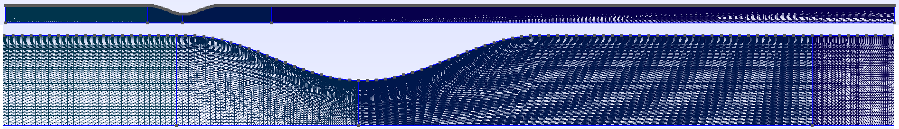

# Tutorial 3: Resolvent Analysis

## Goal of the Tutorial
The goal of this tutorial is to provide a step-by-step guide on performing resolvent analysis in FELICS. By the end of this tutorial, you will be able to:

- Write a mesh file using a python script.
- Import the mean flow data and create a mean flow file for FELiCS.
- Perform resolvent analysis for different frequencies.
- Plot the gains and modes in Python.

## Case Definition
In this tutorial, we will perform incompressible resolvent analysis about the 2D mean flow in a constricted pipe (stenosis). For the geometry details, see Ref. [[1]](#1). The inlet has a steady boundary condition with a Reynolds number 8000 based on the diameter and veloocity in the contraction. Using the case axisymmetry, the 3D solution is solved for a given azimuthal wavenumber.

### Mesh generation
We generate the 2D mesh on GMSH. 
To do so, we write a **.geo** file readable by GMSH using the python script [geoMesh.py](../../TUTORIALS/resolvent_tutorial/geoMesh.py).

Feel free to play with the `CellsFineness` factor to see the influence of finer meshes.

**Warning:** For 2D computations, FELiCS handles only triangular elements only.

Open the .geo file with GMSH an click on "Mesh" and "2D". You should obtain this mesh:

Export the mesh in `File -> Export` in a **.msh** format with `Version 2 ASCII`. Place this `FeliCS_mesh.msh` file in your case folder. 

### Base Flow
Our base flow is obtained by time-azimuthal-averaging the snapshots of a 3D LES. This could be a RANS solution, experimental data, or any other relevant flow field.
Run the python script [meanFlow.py](../../TUTORIALS/resolvent_tutorial/meanFlow.py) to load the mean flow data and write a **.fel** file. This script also allows to define response and forcing domains, a sponge function and an eddy viscosity field.  
Place the `meanFlow.fel` file in your case folder. 

### Boundary conditions
Here we set the axisymmetric boundary conditions in the `boundaries.json` file.
First check in your readable .msh file the boundary ids.
For instance in this file: 
```bash
$MeshFormat
2.2 0 8
$EndMeshFormat
$PhysicalNames
5
1 2 "centerline"
1 3 "inlet"
1 4 "outlet"
1 5 "walls"
```
the IDs of "centerline", "inlet", "outlet", "walls" are respectively 2,3,4,5.

Define the boundaries in the `boundaries.json`. In our case, we set:
| Boundary | $u'_x$ | $u'_r$ | $u'_\theta$ | $p'$ |
|:----------|:-----------|:-----------|:-----------|:-----------|
| <code style="color : Darkorange">Symmetry</code> | Neumann   | Dirichlet  | Dirichlet | Dirichlet |
| <code style="color : Darkorange">Inlet</code> | Dirichlet | Dirichlet | Dirichlet | Dirichlet |
| <code style="color : Darkorange">Outlet</code> | Dirichlet | Dirichlet | Dirichlet | Dirichlet |
| <code style="color : Darkorange">Wall</code> | Dirichlet | Dirichlet | Dirichlet | Neumann |

## Resolvent parameters
The setting file contains all the analysis information. It should be placed in our 
An example of setting file is [resolvent_setting.json](https://git.tu-berlin.de/laboratory-for-flow-instabilities-and-dynamics/felics2.0/-/blob/development/TUTORIALS/resolvent_tutorial/resolvent.json?ref_type=heads). The explanation of each field is provided in [Setting files](hhttps://git.tu-berlin.de/laboratory-for-flow-instabilities-and-dynamics/felics2.0/-/blob/development/DOCUMENTATION/Running_FELiCS/FELiCS_settings.md?ref_type=heads).

The azimuthal wavenumber is chosen:
```json
    "m":0.0,
```
We set the moecular viscosity to be the inverse of the Reynolds number since we non-dimensionalized the variables and equations:
```json
"MolVisc":0.000125,
```
You can increase this field in order to add a uniform eddy viscosity field. 
Ensure consistency in the normalization approach throughout the analysis.

We want to solve the Momentum and Mass equations only and set the other equations in <code style="color : Blue">"SetofEquations"</code> to `"None"`

If we wish to include a turbulent viscolity fields, we should be set:
```json
    {"TurbulenceModel":"File"}
```
The frequencies for which we compute the resolvent modes are provided in the field: 
```json
    {"Omegas":[0.062, 0.10, 0.17, 0.29, 0.48, 0.81, 1.35, 2.26, 3.1, 4.36, 6.28]}
```
We can vary the number of resolvent modes that we want to compute with the field:
```json
    {"nSolut": 2}
```
**NOTE:** The following fields are not relevent for the resolvent analysis:
```json
{"CalculateAdjoint", "EigenValueGuess"}
```
## Running the analysis
Your case folder should look like:
```bash
.
├ FeliCS_mesh.msh
├ meanFlow.fel
├ resolvent_setting.json
├ boundaries.json
├ mixture.json
└── output_dir
```
Run the analysis with the command: 
```bash
FELiCS -f resolvent_setting.json
```
With the provided mesh, it should take about one minute to compute the two resolvent modes for each frequency (~25 minutes).
## Postprocessing
After the computation, check the `output_dir/`. You should find these files: 
```bash
.
└── output_dir
    ├ gains.csv
    ├ meanflow.h5
    ├ Resolvent_mesh.h5
    ├ Resolvent_Omega3.1_Forcing_gain0.xmf
    ├ Resolvent_Omega3.1_Forcing_gain0.h5
    ├ Resolvent_Omega3.1_Response_gain0.xmf
    ├ Resolvent_Omega3.1_Response_gain0.h5
    └ ...
```
We postprocess the outputed files using the python script [PlotMode.py](../../TUTORIALS/resolvent_tutorial/PlotMode.py).

Modify the defined path to your folder and run the script. 

The resolvent gains are plotted against the Strouhal number $St = \omega/2\pi$:
[Figure2](../../TUTORIALS/resolvent_tutorial/gains.png)
Note that in this case, only the leading and subleading resolvent modes were computed. 

The script also include functions to read the mesh, load and plot the mode in matplotlib. 
The forcing and response mode shapes for $p', u_x', u_r'$ at $\omega = 3.1$ should be respectively:
[Figure3: Forcing mode shape](../../TUTORIALS/resolvent_tutorial/ForcingMode_dark.png)
[Figure4: Response mode shape](../../TUTORIALS/resolvent_tutorial/ResponseMode_dark.png)
The $u_\theta$ fluctuation is 0 in this case because we study axisymmetric perturbations ($m=0$).

>**Warning:** The gains provided by FELiCS are $\sigma^2$. The forcing modes have a unitary norm on the defined forcing domain, but the response modes have the norm $\sigma$ on the defined response domain.

## References
<a id="1">[1]</a> 

Villié, A., Schmitter, S., von Saldern, J. G., Demange, S., & Oberleithner, K. . “Physics-informed neural networks for enhancing medical flow magnetic resonance imaging: Artifact correction and mean pressure and Reynolds stresses assimilation”. In: JPhysics of Fluids 37(2) (Jan. 2025). issn: 1089-7666. doi: 10.1063/5.0252852. url: https://pubs.aip.org/aip/pof/article-abstract/37/2/025194/3336391/Physics-informed-neural-networks-for-enhancing?redirectedFrom=fulltext.
