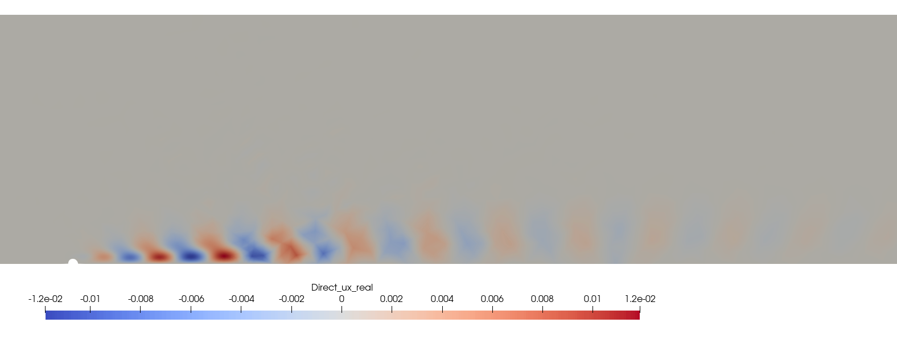
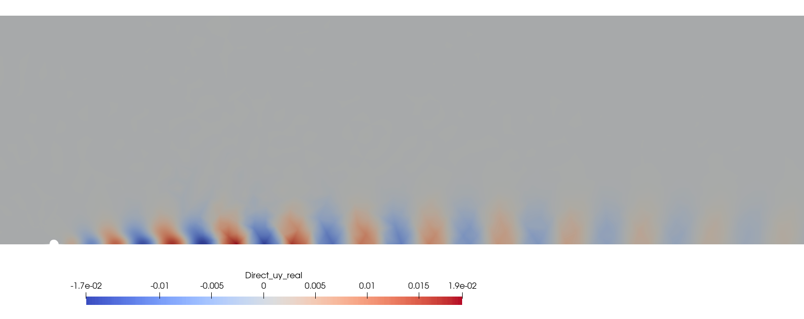

# 1. Goals of the tutorial
In this tutorial, we will do an eigenvalue decomposition of the base flow obtained in the tutorial of [cylinder wake](./cylinder_wake.md). By the end of this tutorial, you will be able to:

- Run a modal analysis case.
- Postprocess modal analysis results with paraview.
# 2. Requirements
Before you begin this tutorial make sure to 
* have completed the [base flow tutorial](./cylinder_wake.md).
* access the case folder ```felics2.0/TUTORIALS/modal_analysis_tutorial``` and copy it into your working directory.

# 3. Modal analysis settings
The setting file, [```modal.json```](./../../TUTORIALS/modal_analysis_tutorial/modal.json) contains all the information relevant for modal analysis. The complete architecture of [```modal.json```](./../../TUTORIALS/modal_analysis_tutorial/bc_modal.json) can be found inside [FELiCS settings](./../Running_FELiCS/FELiCS_settings.md). 

Since the modal analysis is done for the base flow around the cylinder, we therefore will use the same mesh [```cylinder_wake.msh```](./../../TUTORIALS/cylinder_wake_tutorial/cylinder_wake.msh). Hence, inside the file [```modal.json```](./../../TUTORIALS/modal_analysis_tutorial/modal.json) we see that

```json
"MeshFilePath":"cylinder_wake.msh"
```

Furthermore, we will also utilise the base flow field file [```base_flow_for_FELiCS```](./../../TUTORIALS/modal_analysis_tutorial/base_flow_for_FELiCS.fel), which will get generated upon running the [base flow tutorial](./cylinder_wake.md). Therefore

```json
"MeanFlowFilePath": "base_flow_for_FELiCS.fel"
```
It is also very important to note the boundary conditions (BCs) for modal analysis [```bc_Modal.json```](./../../TUTORIALS/modal_analysis_tutorial/bc_modal.json), are quite different fromt the BCs of the [base flow tutorial](./cylinder_wake.md). This is because the BCs for modal analysis are the BCs for the fluctutations on the base flow. The boundary conditions can be formulated as 

| Boundary | $u'_x$     | $u'_y$      | $p'$       |
|:----------|:-----------|:-----------|:-----------|
| <code style="color : Darkorange">Inlet</code>    | Dirichlet | Dirichlet | Dirichlet   |
| <code style="color : Darkorange">Symmetry</code> | Dirichlet   | Neumann | Dirichlet   |
| <code style="color : Darkorange">Outlet</code>   | Dirichlet   | Dirichlet   | Dirichlet |
| <code style="color : Darkorange">Top</code>      | Dirichlet   | Dirichlet | Dirichlet   |
| <code style="color : Darkorange">Wall</code>     | Dirichlet | Dirichlet | Neumann   |

And we specify the its path as 

```json
"BCsFilePath": "bc_modal.json"
```
Lastly and most importantly we initialise the solver using the guess or the initial eigenvalue, and the number of eigenvalues we want the solver to search in its vicinity. Here,

```json
"EigenValueGuess": ["0.7"], //Initital or guess eigevalue
"nSolut": 100 //Number of eigenvalues
```
The modal analysis can be run via 

```sh
FELiCS -f modal.json
```
# 4. Postprocessing
After running the modal analysis, the working directory should look like 

```bash
.
└── logs
└── out 
├ base_flow_for_FELiCS.fel
├ bc_modal.json
├ cylinder_wake.msh
├ modal.json
├ modal.json
├ PlotScatter.py
└ ...
```

Inside the ```out``` directory, the all the eigenmodes in ```.h5``` and ```.xmf``` format can be found, along with eigenspectrum in ```spectrum.csv``` file. The complete spectrum of all the eigenvalues can be plotted via

```sh
python PlotScatter.py
```

 <a id="fig:EigSpec"></a>
Figure 1. The plot of the eigenspectrum

In [Figure 1](#EigSpec), we see an eigenvalue with a positive real part. Therefore, using paraview we visualise the corresponding real eigenmodes encrypted in the file ```ModalSolution_Omega_Direct_(0.745+0.013j).xmf```. 

 <a id="fig:RealUx"></a>

Figure 2. Real eigenmode, $u'_x$

 <a id="fig:RealUy"></a>

Figure 3. Real eigenmode, $u'_y$

 <a id="fig:Realp"></a>

Figure 4. Real eigenmode, $p'$
