# Tutorial 1: Helical Sphere Wake Instability

author: Thomas Ludwig Kaiser

date: March 2020

## Goals of the tutorial

In this first tutorial, an introduction to setting up a FELiCS case will
be given. Neither the physics, nor the numerical methods will be
elaborated on. The interested reader is referenced to Kaiser et
al. [[1,2,3]](#1).

If you haven't yet installed FELiCS, please do so according to the
instructions given in the FELiCS Installation Guide. Furthermore, please
make sure that you have a running gmsh version on your machine.

## Case definition

In this tutorial, we will reproduce the results published by Meliga et
al. [[4]](#4). In their study, they investigated the stability of
the base flow around a sphere. They found that the non swirling base
flow becomes unsteady at $\text{Re}=280.7$ with respect to a
single-helical mode. The respective circular frequency of the mode at
the critical Reynolds number (bifurcation point) is $\omega=0.699$. Due
to the axisymmetric configuration, the problem will be treated in
cylindrical coordinates. In doing so, we take advantage of the
inhomogeneity of the base flow in azimuthal direction and reduce the
problem to two dimensions, which significantly reduces the number of
degrees of freedom.

## Creating a case folder

In the beginning of every set up of a FELiCS case, a case folder should
be created. In this folder the setting file(s) as well as the output
directory or directories for the results will be located. Depending on
the case it might also include the input files.

Most of the input files still need to be created for this tutorial. All
you need is in the SPHERE_WAKE folder provided with the FELiCS code.
Please copy this folder somewhere on your machine and move to the very
same directory:


```bash
cp -r FELiCSDir/TUTORIALS/SPHERE_WAKE workDir/
cd workDir/SPHERE_WAKE
```


## Mesh generation with gmsh

Since the code is using the Finite Element (Dis)Continuous Galerkin
approach, a computational grid needs to be created, which spatially
discretizes the domain. For 2D computations like the one in this
tutorial, the code uses triangular elements only. In order to create the
mesh, the program gmsh is used. An input file for this program called
*SphereWake.geo* is already prepared in the folder. Open it in gmsh
with:


```bash
gmsh SphereWake.geo
```


You should see something like illustrated in
Fig. [1](#fig:MeshingBefore). In the tree menu on the left open the
branch *Mesh* and click on *2D* in order to create a mesh based on the
settings in the .geo file. The result should look similar to
Fig. [2](#fig:MeshingAfter).


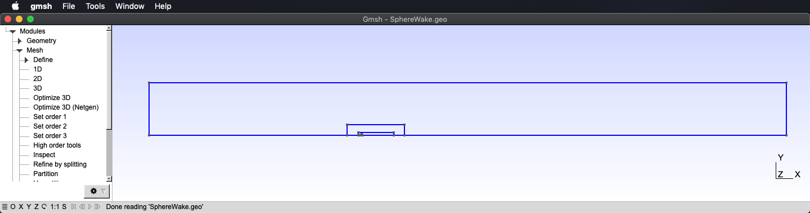 <a id="fig:MeshingBefore"></a>

<p style="text-align: center;">Figure 1: Meshing user interface</p>


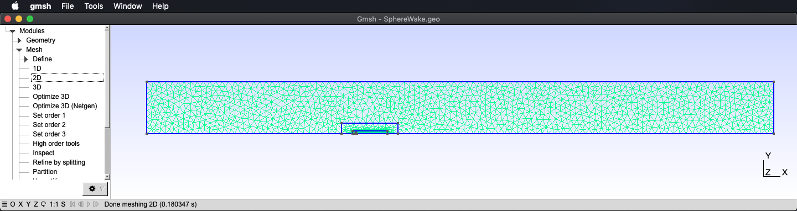 <a id="fig:MeshingAfter"></a>

<p style="text-align: center;">Figure 2: Meshing user interface: after mesh was created</p>


Now we would like to save the mesh we just created. To do so, click on
*File*$\rightarrow$*Export\...* as illustrated in
Fig [3](#fig:saveMesh).

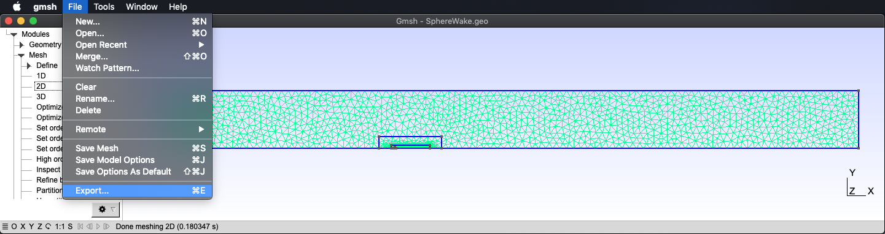 <a id="fig:saveMesh" width=700></a>

<p style="text-align: center;">Figure 3: Meshing user interface: export mesh</p>

Then choose .msh as the file extension for the new file (see
Fig. [4](#fig:saveMesh2)),

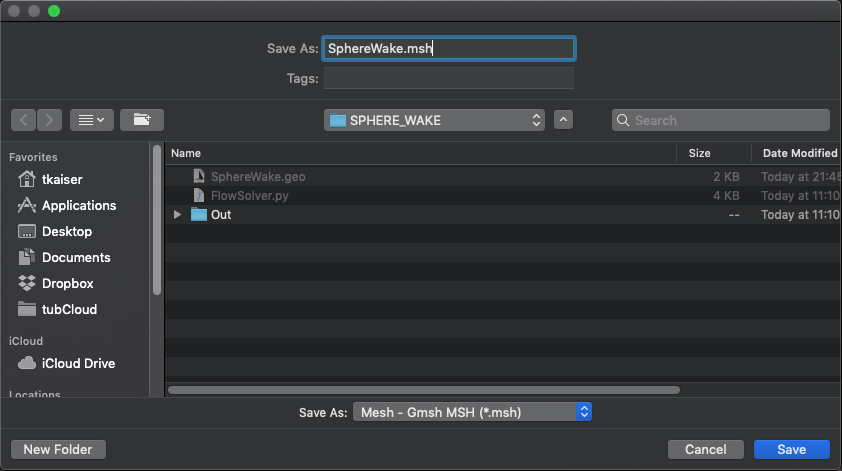 <a id="fig:saveMesh2"></a>

<p style="text-align: center;">Figure 4: Meshing user interface: save mesh</p>


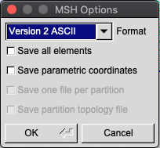 <a id="fig:saveMesh3" width=800></a>

<p style="text-align: center;">Figure 5: Meshing user interface: MSH options</p>

and finally, and this is very important, save the file in *Version 2
ASCII* format (Version 2!), as illustrated in
Fig. [5](#fig:saveMesh3). Finally click on *OK* to save the file.

## Obtaining the base flow

The base flow for FELiCS can be obtained by various sources depending on
the case: Numerical simulations, such as RANS, URANS, LES, DNS, as well
as experimental results or analytical models. In this case, we will
calculate our base flow ourselves. But don't worry, everything is
prepared: a finite element Newton solver called FlowSolver.py can be
found in the working directory. The newton flow solver doesn't need to
be adapted, nevertheless, the interested reader will find that it is not
hard at all to solve the flow equations for different Reynolds numbers.

Before the solver can be started, the conda environment FELiCS created
during the installation needs to be activated:


```bash
conda activate FELiCS
```


Subsequently the Newton flow solver needs to be started *via*


```bash
python FlowSolver.py
```


After a few seconds a window similar to
Fig. [6](#fig:BaseFlow1)
pops up showing the resulting base flow. By using the magnifier glass
the section around the cylinder can be magnified as seen in
Fig [7](#fig:BaseFlow2).

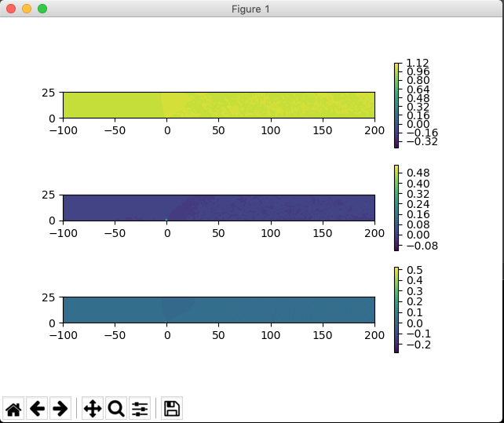 <a id="fig:BaseFlow1" width=800></a>

<p style="text-align: center;">Figure 6: Base Flow</p>


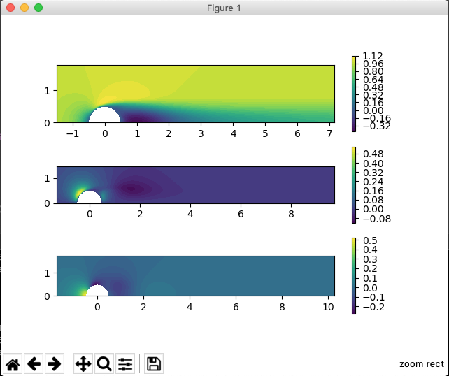 <a id="fig:BaseFlow2" width=800></a>

<p style="text-align: center;">Figure 7: Base Flow: close-up</p>


Furthermore, the solver saves the resulting base flow in a hdf5 file
(*sphere_base_flow.hdf5*), which can be loaded by FELiCS.

## Modal analysis of the sphere wake flow with FELiCS

Now that the mesh and the base flow is created, the modal analysis can
be conducted. To do so, start the `FELiCS` software in the working
directory:


```bash
FELiCS
```


As a result, the GUI appears and should look similar to
Fig. [8](#fig:Settings1). Since no setting file is available a new
settings file must be created via the button
\"`Create/Export Settings to File`\" on the top right. Insert a file
name and save it with the file extension `.set` .

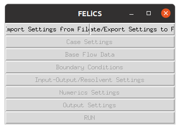 <a id="fig:Settings1" width=400></a>

<p style="text-align: center;">Figure 8: GUI</p>


After that, the \"`Case Settings`\"-button is available. Click on that
button and apply the following changes:

-   Change the `Coordinate System` to `Cylindrical` using the drop-down
    menu.

-   The `Analysis Type` is `Modal` since the intrinsic stability of the
    flow is investigated. The remaining modes will be explained in
    subsequent tutorials.

-   The `Molecular Viscosity` is equal to $\frac{1}{\mathrm{Re}},
    since the length scale is $D=1and the velocity at infinity is
    $U=1$. Here, a Reynolds number of $\mathrm{Re}=280.7is examined.
    Consequently, the molecular viscosity is constant $0.00356252$.

-   The `Transversal wave number` needs to be set to 1.0, since a single
    helical mode is investigated.

Load the mesh file \"`SphereWake.msh`\" we just created and make sure
that the setup window looks similar to
Fig. [9](#fig:Settings2). Then save and close.

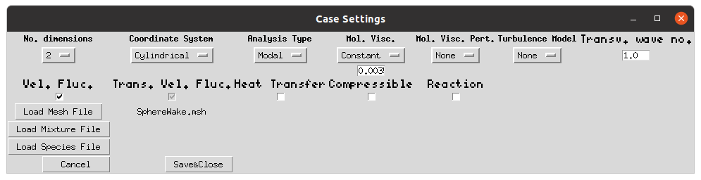 <a id="Settings2" width=700></a>

<p style="text-align: center;">Figure 9: Settings</p>


As a next step, click on the button \"Base Flow Data\" in the `FELiCS`
GUI. Load the MeanFlow File `sphere_base_flow.hdf5`, which was created
by `FlowSolver.py`, like shown in
Fig. [10](#fig:Settings3) and click on \"`Save&Close`\".

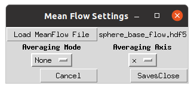 <a id="fig:Settings3" width=400></a>

<p style="text-align: center;">Figure 10: Mean Flow Settings</p>


Now we need to specify the boundary conditions for the flow. To do so,
click on the button \"`Boundary Conditions`\" in the `FELiCS` GUI. A
window like in Fig [11](#fig:Settings8) should pop up. With the button
\"`Load BCs File`\" a previously created FELiCS boundary condition file
with the file extension `*.bc` can be imported. However, since no
boundary condition file is prepared, it must be created. Choose
\"`Create empty BCs File`\", type in a file name, save and return to the
boundary condition window.

This window lists the boundary conditions for each quantity (axial
velocity `ux`, radial velocity `ur`, azimuthal velocity `ut`, pressure
`p`) at every boundary, which is indexed in the `.geo` file. In this
case, these are 5 different boundaries, all referenced by an index and
framed by a colour: The inlet with index 1 in blue, the symmetry line
with index 2 in green, the outlet with index 3 in red, the outer
boundary with index 4 in turquoise and the sphere wall with index 5 in
purple. The different boundaries are shown in the respective color in
the mesh plot in the middle of
Fig. [11](#fig:Settings8). The dropdown menues and the textfields are
directly linked to the boundary condition file in the background and
will be saved there by clicking on \"`Save BCs to File&Close`\".

For all boundaries far from the cylinder, i.e. the inlet, the outlet and
the outer boundary, all fluctuations are set to zero by imposing a
homogeneous (zero valued) Dirichlet boundary condition. At the cylinder
wall, all velocity components are zero (also homogeneous Dirichlet),
while the normal gradient of the pressure with respect to the cylinder
surface needs to be (approximately) zero, which is achieved by a homogeneous (zero
valued) Neumann boundary condition.

The resulting boundary condition window should look now like the one
illustrated in Fig [11](#fig:Settings8).

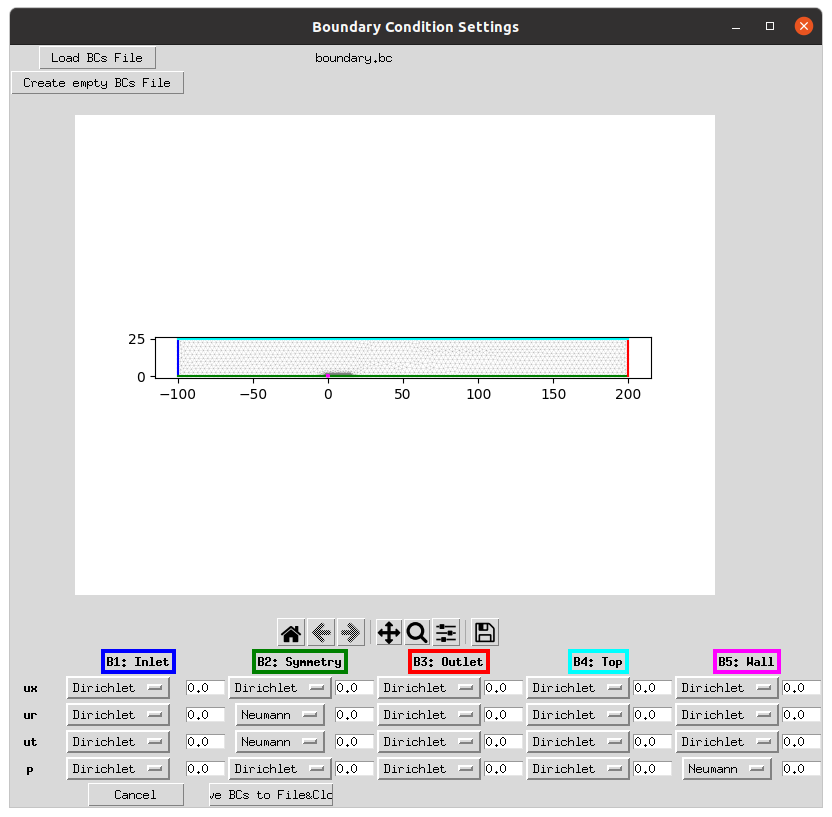 <a id="fig:Settings8" width=700></a>

<p style="text-align: center;">Figure 11: Boundary Conditions</p>


As we are doing a modal analysis and not e.g. an input-output analysis
or resolvent analysis, the button \"`Input-Output/Resolvent Settings`\"
can be skipped and we move on to the `Numerics Settings` by clicking on
the corresponding button. Change the settings as follows:

-   `Number of Solutions` is pretty arbitrary. It can be set to `100`
    but to speed up the convergence, this value can be decreased
    significantly.

-   An iterative eigenvalue solver is used, which needs an initial
    `Eigen value guess`. Since we know the expected value from
    literature (see above [[4]](#4)) we choose a guess of its
    vicinity ($\approx\texttt{0.7}$).

-   The number of CPUs is set to 1. While the other Analysis modes
    (*Resolvent Analysis* and *Input-Output Analysis*) are fully
    parallelized, no speed up can be expected for the *Modal Analysis*.

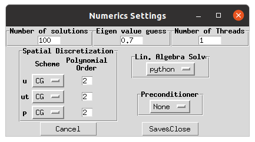 <a id="Settings9" width=700></a>

<p style="text-align: center;">Figure 12: Numerics Settings</p>


Lastly, the output directory, where the results of the computational run
will be stored, needs to be specified. To do so, click on the
\"`Output Settings`\"-button and click on \"`Choose export folder`\" to
select the out folder in the working directory. The export mode is
chosen to be `vtk`, so that a file readable with paraView is exported to
the output folder

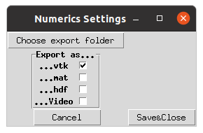 <a id="fig:Settings10" width=400></a>

<p style="text-align: center;">Figure 13: Output Settings</p>


Click now on the \"`Create/Export Settings to File`\"-button on the top
right of the GUI in order to save the settings. Overwrite the settings
file we initialized in the beginning.

Finally, we are ready to launch the calculation. To do so, click on the
\"`RUN`\"-button. After a short computation time, the solutions are
illustrated. First the stability spectrum is shown as in
Fig [14](#fig:Settings11). The direct modes are shown by blue crosses,
while the adjoint modes are shown by red circles:

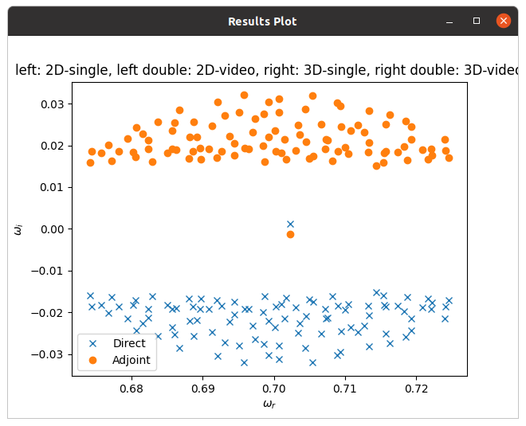 <a id="fig:Settings11" width=600></a>

<p style="text-align: center;">Figure 14: Results</p>

As expected, one marginally stable mode is found close to the real axis,
while a lot of modes are found, which have a negative growth rate. Every
mode shape related to an eigenvalue in the spectrum can be both plotted
to the screen (as seen in Fig [15](#fig:Settings12) after magnifying close to the cylinder) as
well as exported to the output directory.

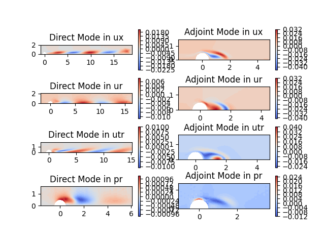 <a id="fig:Settings12" width=600></a>

<p style="text-align: center;">Figure 15: Results: Mode shapes</p>


## Conclusion

The helical instability in the wake of a sphere was analyzed. The user
learned how to create a mesh with gmsh and export it to a format
readable by FELiCS. The base flow at $\mathrm{Re}=280.7$ was created
using a newton flow solver. The user learned how to set up a FELiCS case
and perform a modal analysis on an isothermal baseflow. The results are
very close to the ones published by Meliga et al. [[4]](#4).\
Transfer tasks for the user:

1.  The value was close to the one reported in the literature, but not
    quite the same. Does the analysis converge to the literature result
    after mesh convergence was reached?

2.  What changes in comparison to a cylinder wake flow? Perform the
    equivalent analysis on a cylinder wake flow (bifurcation point
    $\mathrm{Re}\approx47$). The necessary files can be found in
    FELiCSDir/TUTORIALS/CYLINDER_WAKE.


## References
<a id="1">[1]</a> 
Thomas Ludwig Kaiser, Thierry Poinsot, and Kilian Oberleithner. “Stability and Sensitivity Analysis of
Hydrodynamic Instabilities in Industrial Swirled Injection Systems”. In: Journal of Engineering for Gas
Turbines and Power 140.5 (Jan. 2018), p. 051506. issn: 0742-4795. doi: 10.1115/1.4038283. url: http:
//gasturbinespower.asmedigitalcollection.asme.org/article.aspx?doi=10.1115/1.4038283.

<a id="2">[2]</a> 
Thomas Ludwig Kaiser et al. “Examining the Effect of Geometry Changes in Industrial Fuel Injec-
tion Systems On Hydrodynamic Structures with Biglobal Linear Stability Analysis”. In: Journal of
Engineering for Gas Turbines and Power (Sept. 2019). issn: 0742-4795. doi: 10 . 1115 / 1 . 4045018.
url: https://asmedigitalcollection.asme.org/gasturbinespower/article/doi/10.1115/1.
4045018/1047002/Examining-the-Effect-of-Geometry-Changes-in.

<a id="3">[3]</a> 
Thomas Ludwig Kaiser et al. “Impact of symmetry breaking on the Flame Transfer Function of a laminar
premixed flame”. In: Proceedings of the Combustion Institute 37.2 (2019), pp. 1953–1960. issn: 1540-
7489. doi: https://doi.org/10.1016/j.proci.2018.06.047. url: http://www.sciencedirect.
com/science/article/pii/S154074891830230X.

<a id="4">[4]</a> 
Philippe Meliga, J-M Chomaz, and D Sipp. “Unsteadiness in the wake of disks and spheres: instability,
receptivity and control using direct and adjoint global stability analyses”. In: Journal of Fluids and
Structures 25.4 (2009), pp. 601–616.
