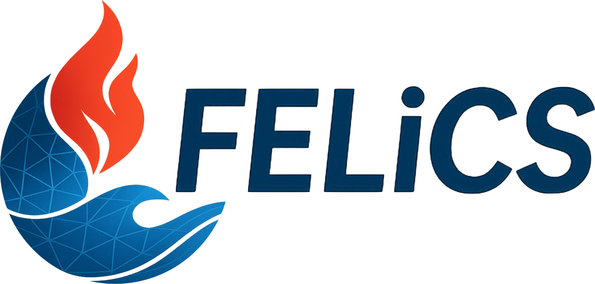

<p align="center">
  
</p>


## Welcome to FELiCS

[](https://felics2-0-laboratory-for-flow-instabilities-and--112f91add91c56.gitlab-pages.tu-berlin.de/)
[](https://www.felics.eu)
[](https://git.tu-berlin.de/laboratory-for-flow-instabilities-and-dynamics/felics2.0/-/wikis/)
[](https://git.tu-berlin.de/laboratory-for-flow-instabilities-and-dynamics/felics2.0/-/blob/development/LICENSE.txt)
[](https://git.tu-berlin.de/laboratory-for-flow-instabilities-and-dynamics/felics2.0/-/releases)

[](https://git.tu-berlin.de/laboratory-for-flow-instabilities-and-dynamics/felics2.0/-/pipelines)
[](https://git.tu-berlin.de/laboratory-for-flow-instabilities-and-dynamics/felics-tests)


FELiCS (*Finite Element Linearized Combustion Solver*) is a Python-based CFD tool for linearized flow analysis, developed at the Laboratory for Flow Instabilities and Dynamics at TU Berlin. It is designed for both academic research and real-world engineering applications, supporting turbulence, heat/mass transport, chemical reactions, acoustics, and more.

<!-- <div align="center"> -->

## Features

- Linearized flow analysis for stability studies
- Multi-physics support including combustion and acoustics
- Designed for both academic research and industrial applications
- Comprehensive documentation and developer resources

## Quick Start

<a href="https://felics2-0-laboratory-for-flow-instabilities-and--112f91add91c56.gitlab-pages.tu-berlin.de/">
  
</a>

## Installation

Detailed installation instructions are available in the [documentation](https://felics2-0-laboratory-for-flow-instabilities-and--112f91add91c56.gitlab-pages.tu-berlin.de/installation_guide.html).

## Contributing

We welcome contributions from the community! Please refer to our [Contribution Guide](CONTRIBUTING.md) for:

- Reporting bugs and requesting features
- Development setup instructions
- Code style guidelines
- Pull request process

## Citation

If you use FELiCS in a scientific publication, we would appreciate citing [this paper](https://arc.aiaa.org/doi/10.2514/6.2023-3434) using the following citations:

```
@inproceedings{Kaiser_felics,
   author = {Thomas L. Kaiser and Simon Demange and Jens S. Müller and Sophie Knechtel and Kilian Oberleithner},
   city = {Reston, Virginia},
   doi = {10.2514/6.2023-3434},
   isbn = {978-1-62410-704-7},
   journal = {AIAA AVIATION 2023 Forum},
   month = {6},
   publisher = {American Institute of Aeronautics and Astronautics},
   title = {FELiCS: A Versatile Linearized Solver Addressing Dynamics in Multi-Physics Flows},
   url = {https://arc.aiaa.org/doi/10.2514/6.2023-3434},
   year = {2023},
}
```


## License

FELiCS is free and open-source software released under the **GNU General Public License v3.0** (GPL-3.0), a strong copyleft license that ensures the software remains free and open.

**What this means:**
- You are free to use, modify, and distribute FELiCS
- Any derivative works must also be released under GPL-3.0
- Commercial use is permitted under the license terms

For the complete license terms, see [LICENSE.txt](LICENSE.txt).

## Contact

We are always looking for new collaborators and feedback!

- **Get in Touch**: Reach out to us via <a href="mailto:&#105;&#110;&#102;&#111;&#64;&#102;&#101;&#108;&#105;&#99;&#115;&#46;&#101;&#117;">email</a> for research collaborations, other inquiries, or specific questions about the solver.
- **Updates**: Stay updated on the latest news by visiting our [website](https://www.felics.eu).
