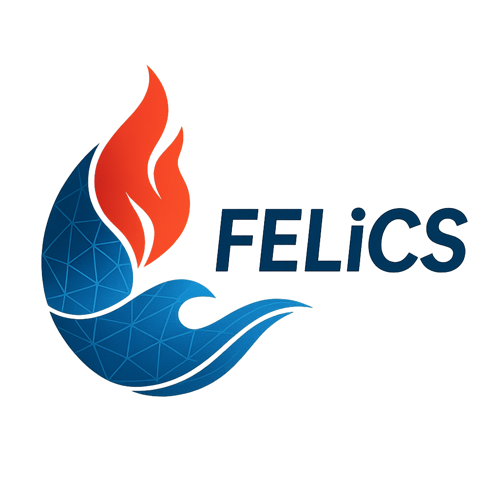

<p align="center">
  
</p>


## Welcome to FELiCS 2.0

[](https://felics2-0-laboratory-for-flow-instabilities-and--112f91add91c56.gitlab-pages.tu-berlin.de/)
[](https://www.tu.berlin/flow/forschung/projekte/felics-projekt)
[](https://git.tu-berlin.de/laboratory-for-flow-instabilities-and-dynamics/felics2.0/-/wikis/)

#
[](https://git.tu-berlin.de/laboratory-for-flow-instabilities-and-dynamics/felics2.0/-/pipelines)
FELiCS (*Finite Element Linearized Combustion Solver*) is a Python-based CFD tool for linearized flow analysis, developed at the Laboratory for Flow Instabilities and Dynamics at TU Berlin. It is designed for both academic research and real-world engineering applications, supporting turbulence, heat/mass transport, chemical reactions, acoustics, and more.

<!-- <div align="center"> -->

## **Get Started with FELiCS**

<a href="https://felics2-0-laboratory-for-flow-instabilities-and--112f91add91c56.gitlab-pages.tu-berlin.de/">
  
</a>

</div>

---

## Contribute

FELiCS is under active development and contributors are welcome. If you are contributing to FELiCS, please start by reading the documentation to understand the overall structure and usage of the codebase. For coding standards and documentation guidelines, refer to the [Wiki](https://git.tu-berlin.de/laboratory-for-flow-instabilities-and-dynamics/felics2.0/-/wikis/).

Before submitting new code, ensure it is tested using the available validation cases. The validation cases can be downloaded from [this gitlab repository](https://git.tu-berlin.de/laboratory-for-flow-instabilities-and-dynamics/felics-tests).

## Citation

If you use FELiCS in a scientific publication, we would appreciate citing [this paper](https://arc.aiaa.org/doi/10.2514/6.2023-3434) using the following citations:

```
@inproceedings{Kaiser_felics,
   author = {Thomas L. Kaiser and Simon Demange and Jens S. Müller and Sophie Knechtel and Kilian Oberleithner},
   city = {Reston, Virginia},
   doi = {10.2514/6.2023-3434},
   isbn = {978-1-62410-704-7},
   journal = {AIAA AVIATION 2023 Forum},
   month = {6},
   publisher = {American Institute of Aeronautics and Astronautics},
   title = {FELiCS: A Versatile Linearized Solver Addressing Dynamics in Multi-Physics Flows},
   url = {https://arc.aiaa.org/doi/10.2514/6.2023-3434},
   year = {2023},
}
```


## License

FELiCS is free and open-source software released under the **GNU General Public License v3.0** (GPL-3.0), a strong copyleft license that ensures the software remains free and open.

**What this means:**
- You are free to use, modify, and distribute FELiCS
- Any derivative works must also be released under GPL-3.0
- Commercial use is permitted under the license terms

For the complete license terms, see [LICENSE.txt](LICENSE.txt).