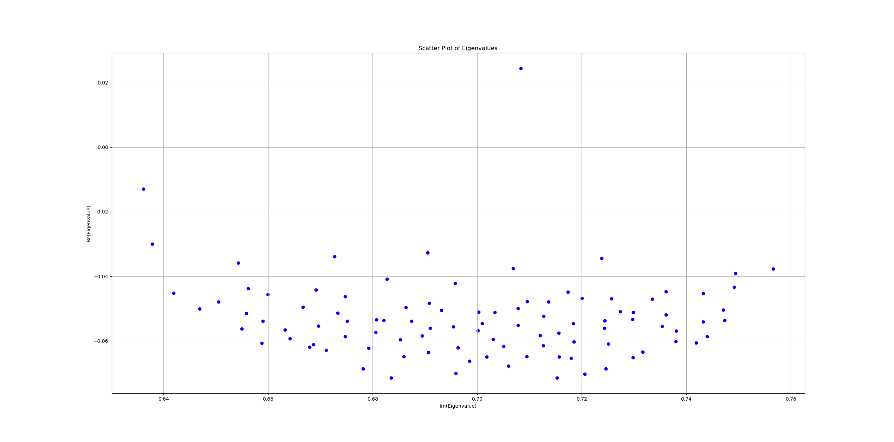

1. Import of Python packages.
```py
import time
```

2. Import of FELiCS packages.

```py
from FELiCS.IO.ExportSolution           import ExportFromFile 
import FELiCS.SpaceDisc.DefineFEMSpaces as DefineFEMSpaces
from FELiCS.Fields.meanFlowClass        import meanFlowClass
from FELiCS.Parameters.config           import config
from FELiCS.Equation.EquationCollection import EquationCollectionClass
from FELiCS.Misc.functions              import printDebug
from FELiCS.Solvers.LinearSolver        import LinearSolver 
from FELiCS.Fields.ModeCollectionimport import ModeCollection
from FELiCS.Misc.logging                import Logger

# Get the logger
logger = Logger.get_logger("felics")
```

3. In this tutorial the Modal Analysis has been done for base flow with $Re = 125$. Hence, the flow field is imported through the file <code style="color : Darkorange">base_flow_for_FELiCS_125.fel</code>, with its path also defined in the settings file <code style="color : Darkorange">Re125_Modal.json</code>. 

```py
flowFilename         = 'base_flow_for_FELiCS_125.fel'
configFilename_Modal = 'Re125_Modal.json'
param = config()
param.importFromFile(configFilename_Modal)
mesh = param.getMesh()
# FEMSpaces
FEMSpaces = DefineFEMSpaces.FEMSpacesClass(param, mesh)

# read in mean flow
meanFlow = meanFlowClass(param, FEMSpaces, mesh)
meanFlow.importDataFromFile()
```

4. The meanflow and the mesh need to be saved as <code style="color : Darkorange">.hdf5</code> so that the mesh can be utilized again while saving the eigenmodes in <code style="color : Darkorange">.xmf</code> and <code style="color : Darkorange">.hdf5</code> formats.

```py
if not param.FlowInput.MeanFlowFilePath.split('.')[-1] == 'hdf5':
    meanFlow.exportBaseFlowAsHDF5()
meanflowFilename = flowFilename
meanFlow.mapToExportMeshAndExport(FEMSpaces, meanflowFilename)
```


The non-dimensional and incompressible Navier-Stokes equations given by
$$
    \nabla \cdot \bold{u} = 0,
$$
$$
   \mathrm{Re} (\partial_t \bold{u} + (\bold{u} \cdot \nabla) \bold{u} ) = - \nabla p +  \nabla^2 \bold{u}.
$$

Linearizing the Navier-Stokes equations via $\bold{u} = \bold{u}_b + \epsilon \bold{u}'$ and $p = p_b + \epsilon p'$ where the subscript $_b$ denotes the base-flow, and considering terms of the order of $\epsilon$, we have

$$
    \nabla \cdot \bold{u}' = 0
$$

$$
    \mathrm{Re} (\partial_t \bold{u}' + (\bold{u}_b \cdot \nabla) \bold{u}' + (\bold{u}' \cdot \nabla ) \bold{u}_b   ) = - \nabla p' + \nabla^2 \bold{u}'
$$

```py
# equation
equation = EquationCollectionClass(param, FEMSpaces, meanFlow, mesh)
```

Splitting up the temporal and spatial parts of the solution as $\bold{u}' = \hat{\bold{u}} e^{-i \omega t}$ and $p' = \hat{p} e^{-i\omega t}$ which yeilds the following generalized Eigenvalue problem (GEVP)

$$
    \mathrm{Re} (-i \omega \hat{\bold{u}} + \underbrace{(\bold{u}_b \cdot \nabla ) \hat{\bold{u}}  + (\hat{\bold{u}} \cdot \nabla ) \bold{u}_b}_{C \hat{\bold{u}}} ) = \underbrace{- \nabla \hat{p}}_{G \hat{p}} + \underbrace{\nabla^2 \hat{\bold{u}}}_{D \hat{\bold{u}}}
$$

In the matrix form the GEVP can be formulated as

$$
    \omega \underbrace{\begin{bmatrix}
        -i*\mathrm{Re} & 0 \\
        0     & 0
    \end{bmatrix}}_{B}

    \begin{bmatrix}
        \hat{\bold{u}} \\
        \hat{p}
    \end{bmatrix}
    =

    \underbrace{\begin{bmatrix}
        \mathrm{Re}*C+D & 0 \\
        0 & G
    \end{bmatrix}}_{A}

    \begin{bmatrix}
        \hat{\bold{u}} \\
        \hat{p}
    \end{bmatrix}
$$

```py
A = equation.getLinearOperator(meanFlow)
B = equation.getWeightMatrix(meanFlow)
```

Based on the initial guess of the Eigen value, which is supplied in the <code style="color : Darkorange">Re125_Modal.json</code> file as {..., <code style="color : Cyan">Numerics</code>: {<code style="color : Cyan">EigenValueGuess</code>: [...], ...}, ...}  a desired number of Eigen values <code style="color : Cyan">nSolut</code>,  are searched in its vicinity. 

```py
# get parameters for eigenproblem
guess  = param.Numerics.EigenValueGuess
nSol   = param.Numerics.nSolut
```

The GEVP is solved for the Eignemodes and the Eigenvalues using the matrices $A$ and $B$ such that the numerical error is <code style="color : Cyan">residuum_max</code> . The solution of the GEVP is stored in the <code style="color : Cyan">solution</code> object.

```py
start = time.time()
solution = ModeCollection(FEMSpaces.VMixed, mesh)
logger.info("Solving direct GEVP for guess: omega = " + str(guess[0]))
tmp = LinearSolver.solveGeneralEigenproblem(A, B, guess[0], nSol)
solution.appendSolutionOfEigenProblem(tmp, guess[0])
residuum_max = solution.getMaximumError()
end = time.time()
logger.info("Numerical Error = "+ str(residuum_max))
logger.info("Computational Time = "+ str(end-start)+ " s")
```

The Eigenmodes will be saved in both <code style="color : Darkorange">.xmf</code> and <code style="color : Darkorange">.h5</code> formats. The <code style="color : Darkorange">.xmf</code> format can be visualised using Paraview and the list of the real and imagninary Eigenvalues can be found in the file <code style="color : Darkorange">./out/spectrum.csv</code>.

```py
fluctSolutList = solution.getOldSolutionObject(meanFlow, param, FEMSpaces)
ExportFromFile(param,FEMSpaces,fluctSolutList,meanFlow)

```

The real and the imaginary parts of the Eigen values are plotted against each other. The presence of a positive Eigen value indicates the growthrate or the flow instability.

```py
from ExtractCSVData import *
import matplotlib.pyplot as plt

import matplotlib
matplotlib.use('TkAgg')

x_coords, y_coords = read_csv_file("./out/spectrum.csv")
# Plotting
fig = plt.figure(figsize=(9, 6))
plt.scatter(x_coords, y_coords, c='blue', marker='o')
plt.title('Scatter Plot of Eigenvalues')
plt.xlabel('Im(Eigenvalue)')
plt.ylabel('Re(Eigenvalue)')
plt.grid(True)
plt.show()

```
The scatter plot of the Eigen values looks like : 
