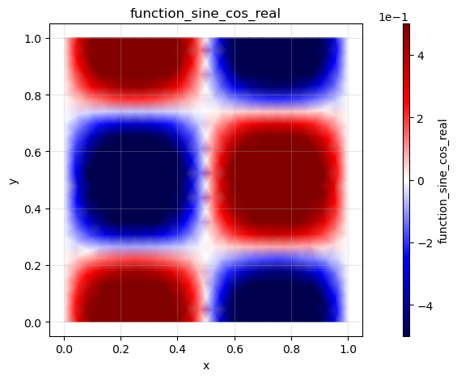
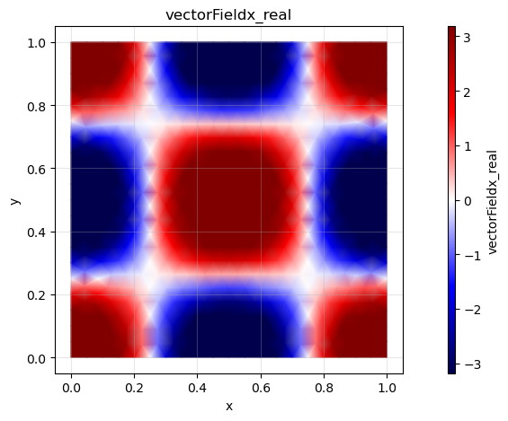
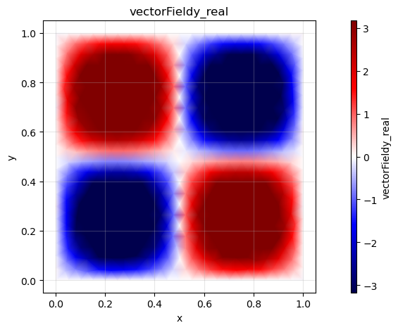
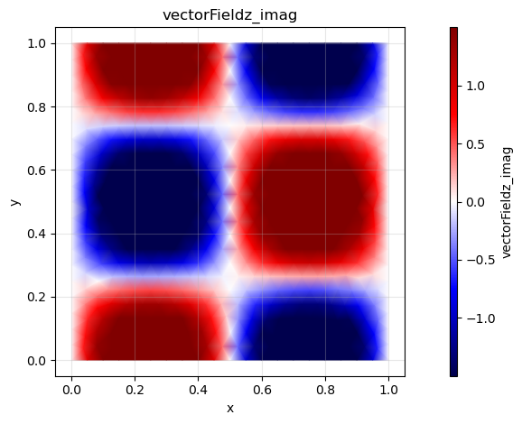

# How to calculate the spatial gradient of a scalar field in cartesian coordiantes

FELiCS can be used to calculate the spatial gradient of a quantity with a few commands. Here, the following cases are described:
- cartesian coordinates: square 2D domain
- cartesian coordinates with spectral dimension: the de-facto 2D domain can be imagined as a 3D channel, which is periodically expanded in the third direction

### Cartesian coordinates on a 2D domain
Here, the gradient of a scalar field on a square 2D mesh is computed. We define our scalar field as follows:

$$\phi(x,y) = \sin(2\pi x)\cos(2\pi y)$$


**Step 1: Create FELiCSMesh, FELiCSSpace and Field**


```python
from FELiCS.SpaceDisc.FELiCSMesh import FELiCSMesh
from FELiCS.SpaceDisc.FEMSpaces  import create_function_space
from FELiCS.Fields.Field         import Field
from FELiCS.IO.Reader            import Reader

meshFileName = "./square_mesh.msh"
coordinateSystemName = "Cartesian"

# create a FELiCS mesh from the gmsh file
mesh = FELiCSMesh(coordinateSystemName, meshFileName)

# create a scalar space
scalarSpace = create_function_space(mesh, degree=2, dim=1)

# create a Field object and import the data from the h5 file
phi = Field(scalarSpace, mesh=mesh, name="function_sine_cos") 
phi.import_data(Reader(), "input.h5")

```

  
    Info     | FELiCSMesh.py          | __init__                   (line 124 ) : Opening mesh file: ./square_mesh.msh
    Info     | FELiCSMesh.py          | __init__                   (line 132 ) : Mesh contains 513 nodes and 1024 elements
    Info     | Reader.py              | _interpolate_to_calc_mesh  (line 706 ) : Linear interpolation took 0.6 seconds. (Mesh size: (1969, 2))


    (<FELiCS.Fields.Field.Field at 0x17fee7770>, [])


**Step 2: Get gradient as a vector field and extract the scalar fields**

We now want to calculate the gradient of our scalar quantity using the `getGradientField()` method of our Field class. This method returns a Field object, which represents a vector-field as we calculate the gradient of a scalar with respect to our two spatial and one spectral dimension. The gradient is defined as

$$
\nabla \phi = \left(\frac{\partial \phi}{\partial x}, \frac{\partial \phi}{\partial y}\right)\ .
$$

So for our function the analytical gradient is

$$
\nabla \phi = \begin{pmatrix}
2\pi \cos(2\pi x) \cos(2\pi y) \\
-2\pi \sin(2\pi x) \sin(2\pi y) 
\end{pmatrix}\ .
$$

The resulting field is defined on a vector space with 2 dimension. We can also transform it in two scalar fields via the command 'getListOfSingleFields()'.


```python
gradPhi = phi.get_gradient_field() # this is a vector field

# get scalar fields from gradient:
gradList = gradPhi.get_list_of_sub_fields()
phi_x    = gradList[0]
phi_y    = gradList[1]
```

    ld: warning: duplicate -rpath '/opt/anaconda3/envs/felics/lib' ignored
    ld: warning: duplicate -rpath '/opt/anaconda3/envs/felics/lib' ignored
    ld: warning: duplicate -rpath '/opt/anaconda3/envs/felics/lib' ignored
    ld: warning: duplicate -rpath '/opt/anaconda3/envs/felics/lib' ignored


**Step 2: Postprocessing**

Exporting as h5 file and visualization of the gradients by using the FELiCS plotting function:


```python
from FELiCS.IO.Writer import Writer
gradPhi.export_to_h5(Writer())

phi.plot()
phi_x.plot()
phi_y.plot()
```


    

    


    

    


    

    


### Cartesian coordinates with spectral dimension
Here, to the two spatial dimensions (x and y) a third spectral dimension in z-direction is added.
With the spectral dimension the scalar field becomes

$$\phi \cdot e^{imz}$$

where m is the wave number. With the wave number we represent a periodicity of the flow in z-direction, while still only calculating a 2D flowfield.

**Step 1: Create FELiCSMesh, FELiCSSpace and Field**


```python
from FELiCS.SpaceDisc.FELiCSMesh import FELiCSMesh
from FELiCS.SpaceDisc.FEMSpaces  import create_function_space
from FELiCS.Fields.Field         import Field
from FELiCS.IO.Reader            import Reader

meshFileName = "./square_mesh.msh"
coordinateSystemName = "Cartesian"
m = 3

# create a FELiCS mesh from the gmsh file
# by setting m to an integer number that is not zero, the spectral direction is added to the coordinate system
mesh = FELiCSMesh(coordinateSystemName, meshFileName, m=m) 

# create a scalar space
scalarSpace = create_function_space(mesh, degree=2, dim=1)

# create a Field object and import the data from the h5 file
# by setting m to an integer number that is not zero, the spectral direction is added to the field
phi = Field(scalarSpace, mesh=mesh, name = "function_sine_cos", m = m) 
phi.import_data(Reader(),"input.h5")

```

    Info     | FELiCSMesh.py          | __init__                   (line 124 ) : Opening mesh file: ./square_mesh.msh
    Info     | FELiCSMesh.py          | __init__                   (line 132 ) : Mesh contains 513 nodes and 1024 elements
    Info     | Reader.py              | _interpolate_to_calc_mesh  (line 706 ) : Linear interpolation took 0.6 seconds. (Mesh size: (1969, 2))


    (<FELiCS.Fields.Field.Field at 0x304e6fa50>, [])


**Step 2: Calculate the gradient**

With the spectral dimension, the gradient is now 3-dimensional:

$$\nabla \phi = \left(\frac{\partial \phi}{\partial x}, \frac{\partial \phi}{\partial y}, \frac{\partial \phi}{\partial z}\right)$$

and it is defined as:

$$\nabla \phi = \begin{pmatrix}
2\pi \cos(2\pi x) \cos(2\pi y) \cdot e^{imz} \\
-2\pi \sin(2\pi x) \sin(2\pi y) \cdot e^{imz} \\
im \sin(2\pi x) \cos(2\pi y) \cdot e^{imz}
\end{pmatrix}\ .$$

Note that the derivative in the spectral dimension is imaginary. 


```python
gradPhi = phi.get_gradient_field() # this is a vector field

# get scalar fields from gradient:
gradList = gradPhi.get_list_of_sub_fields()
phi_x    = gradList[0]
phi_y    = gradList[1]
phi_z    = gradList[2]
```

    ld: warning: duplicate -rpath '/opt/anaconda3/envs/felics/lib' ignored
    ld: warning: duplicate -rpath '/opt/anaconda3/envs/felics/lib' ignored
    ld: warning: duplicate -rpath '/opt/anaconda3/envs/felics/lib' ignored
    ld: warning: duplicate -rpath '/opt/anaconda3/envs/felics/lib' ignored


**Step 3: Postprocessing**

Exporting as h5 file and visualization of the gradients by using the FELiCS plotting function:


```python
from FELiCS.IO.Writer import Writer
gradPhi.export_to_h5(Writer())

phi.plot()
phi_x.plot()
phi_y.plot()
phi_z.plot(plotType="imag")
```


    

    


    

    


    

    


    

    


```python

```
