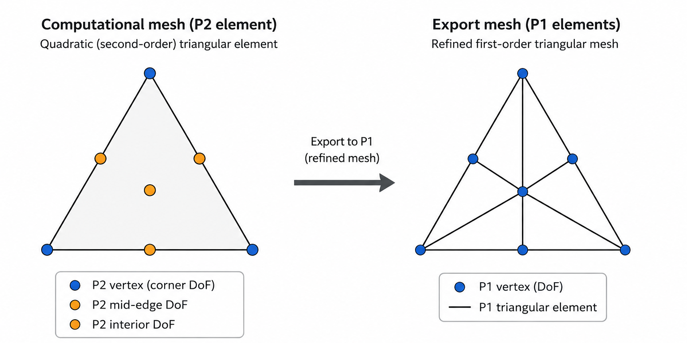

# Mesh output files

FELiCS exports the computational mesh used for solution and mean-flow outputs as:

```text
mesh.h5
```

The file uses the HDF5 format and stores:
- mesh coordinates,
- element connectivity.

Typical datasets include:

```text
/cells/triangles
/coordinates/x
/coordinates/y
```

The file is exported in the output directory defined by the [Export.ExportFolder](../input_files/parameters/Export/ExportFolder.md) parameter.

## Export mesh

FELiCS computations typically rely on finite-element spaces combining:
- first-order (`P1`) elements,
- and second-order (`P2`) elements.

However, the export module from FELiCS expects fields to be defined on first-order meshes.

To ensure compatibility, FELiCS constructs an *export mesh* consisting only of first-order triangular elements.

For second-order (`P2`) finite-element spaces, this is achieved by refining the original computational mesh so that all second-order degrees of freedom become vertices of a first-order export mesh. This is illustrated below:



As a result:
- exported [solution fields](solution_files.md),
- and exported [mean-flow fields](.)

are both defined on this FELiCS export mesh rather than directly on the original computational mesh.