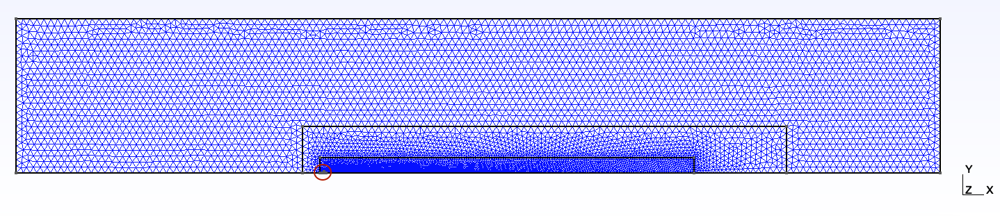
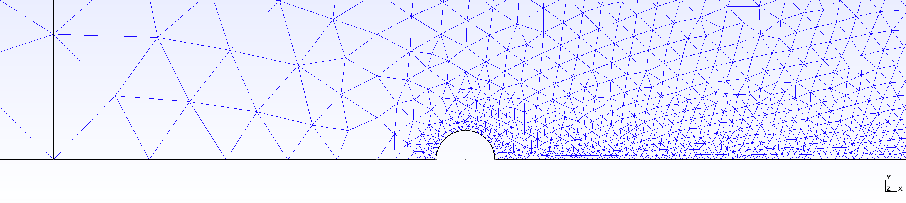
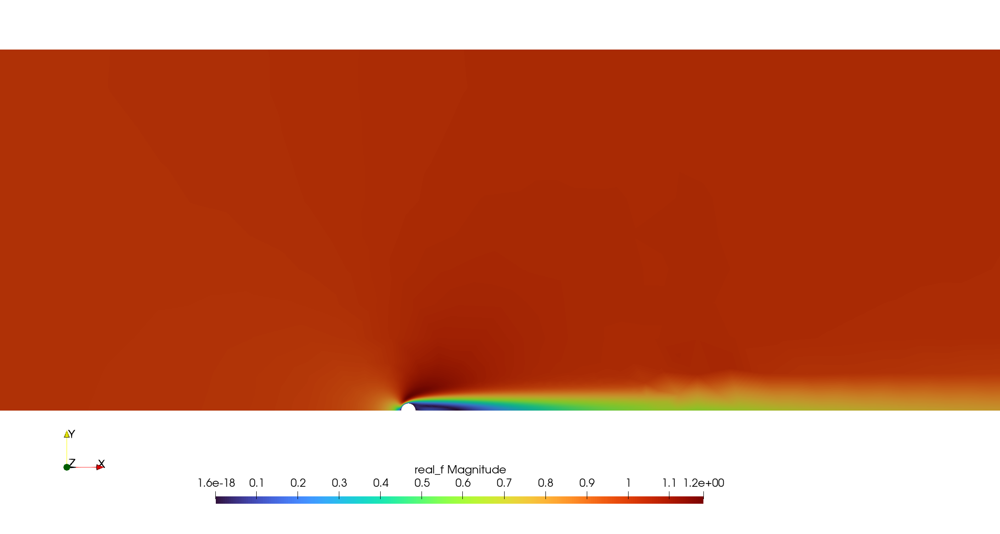

# Tutorial 1: Solve the base flow
## Goals of the tutorial
This first tutorial gives an introduction for setting up a FELiCS case. By the end of this tutorial, you will be able to:

- Define a case in FELiCS.
- Create a case folder with a mesh and base flow files.

## Requirements

* FELiCS should be installed as per the [FELiCS installation guide](https://felics-d43476.gitlab.io/installation_guide.html) with an active conda environment.

* Choose a branch of the FELiCS that contains the base flow solver.

## Case Definition
We want to study the linear stability of a 2D base flow around a cylinder at Reynolds number, $\mathrm{Re} = 50$.
In general it is recommended to create a folder for every case, where the input and output files will be located. Here, the case folder can be found in ```felics/tutorials/cylinder_wake_tutorial```. Copy this tutorial to your working directory ```workDir```
```sh
cp -r felics/tutorials/cylinder_wake_tutorial workDir/
cd workDir/cylinder_wake_tutorial/ 
```

## Mesh generation
Since the code uses the Finite Element Continuous Galerkin approach, a computational grid needs to be created. In order to create the mesh, the package ```python-gmsh``` is used. An input file for this program called [```cylinder_wake_mesh.py```](./../../tutorials/cylinder_wake_tutorial/cylinder_wake_mesh.py) is already prepared in the folder. Upon exceuting it in ```python``` it generates the mesh file [cylinder_wake.msh](./../../tutorials/cylinder_wake_tutorial/cylinder_wake.msh) in Version 2 *ASCII* format.

```sh
python cylinder_wake_mesh.py
```
If you open the mesh in GMSH, click on `Mesh -> 2D`. It should look like:

 <a id="fig:Mesh"></a>
Figure 1. 2D Mesh.

 <a id="fig:MagMesh"></a>
Figure 2. Magnified version of [Figure 1](#fig:Mesh)

```{note}
For 2D computations, only triangular elements can be handeled. 
```
The file [```cylinder_wake.msh```](./../../tutorials/cylinder_wake_tutorial/cylinder_wake.msh) includes the domains:
```sh
$PhysicalNames
6
1 1 "Inlet"
1 2 "Symmetry"
1 3 "Outlet"
1 4 "Top"
1 5 "Wall"
2 6 "all"
$EndPhysicalNames
```
In [Figure 1](#fig:Mesh), <code style="color : Darkorange">Inlet</code> is the left vertical boundary of the domain, <code style="color : Darkorange">Outlet</code> is the right vertical boundary of the domain, <code style="color : Darkorange">Top</code> is the top horizontal boundary of the domain. <code style="color : Darkorange">Symmetry</code> is the bottom horizontal boundary of the domain, except the half-cylinder in [Figure 2](#fig:MagMesh), which is the <code style="color : Darkorange">Wall</code>.
Detailed explanations about the boundary conditions format is provided in the next tutorial. 

## Obtaining the base flow
The base flow for FELiCS can be obtained through various methods: numerical simulations, (RANS, LES, DNS, ...), experimental results or analytical models. In this case, we calculate the base flow ourselves. But don't worry, everything is prepared: a finite element Newton solver called [```solveBaseFlow.py```](./../../tutorials/cylinder_wake_tutorial/solveBaseFlow.py) can be found in the working directory. Before the solver can be started, the conda environment FELiCS created during the installation needs to be activated:
```sh
conda activate felics
```

The settings and the boundary conditions of the base flow can be found in ```Re50.json``` and ```bc.json```. 
In the file ```Re50.json``` we set the molecular viscostiy, $\nu = 0.02$:
```json
"MolVisc": 0.02
```
based on the Reynolds number $\mathrm{Re} = 50$, the cylinder diameter $d = 1$ and the bulk velocity $U_\infty = 1$.
We only solve the continuity and the momentum equation. Therefore we set everything to <code style="color : Darkorange">None</code> in the <code style="color : Blue">"SetofEquations"</code>, except for <code style="color : Blue">"Momentum"</code> and <code style="color : Blue">"Mass"</code>. 

Additionally we import the boundary conditions from [```bc.json```](./../../tutorials/cylinder_wake_tutorial/bc.json). They are summarized in the following tab: 

| Boundary | ID | $u_x$     | $u_y$      | $p$       |
|:----------|:--:|:-----------|:-----------|:-----------|
| <code style="color : Darkorange">Inlet</code>    | 1 | Dirichlet | Dirichlet | Neumann   |
| <code style="color : Darkorange">Symmetry</code> | 2 | Neumann   | Dirichlet | Neumann   |
| <code style="color : Darkorange">Outlet</code>   | 3 | Neumann   | Neumann   | Dirichlet |
| <code style="color : Darkorange">Top</code>      | 4 | Neumann   | Dirichlet | Neumann   |
| <code style="color : Darkorange">Wall</code>     | 5 | Dirichlet | Dirichlet | Neumann   |

We obtain the base flow via running the python script [```solveBaseFlow.py```](./../../tutorials/cylinder_wake_tutorial/solveBaseFlow.py):
```sh
python solveBaseFlow.py
```
After executing [```solveBaseFlow.py```](./../../tutorials/cylinder_wake_tutorial/solveBaseFlow.py), these files are added to the working directory
```bash
.
├── base_flow_for_FELiCS.fel
├── cylinder_wake.msh
├── initial_solution.fel
├── logs/
└── out/
    ├── baseFlow.h5
    ├── baseFlow.xmf
    ├── log/
    ├── mesh.h5
    └── ...
```

The file ```out/baseFlow.xmf``` can be opened in Paraview to visualize the base flow: 


Figure 3. Magnitude of the flow-field. 


<!-- # References
1.   Thomas Ludwig Kaiser, Thierry Poinsot, and Kilian Oberleithner. “Stability and Sensitivity Analysis of
Hydrodynamic Instabilities in Industrial Swirled Injection Systems”. In: Journal of Engineering for Gas
Turbines and Power 140.5 (Jan. 2018), p. 051506. ISSN: 0742-4795. DOI: 10.1115/1.4038283. 
URL: http://gasturbinespower.asmedigitalcollection.asme.org/article.aspx?DOI=10.1115/1.4038283.

 2. Thomas Ludwig Kaiser et al. “Examining the Effect of Geometry Changes in Industrial Fuel Injection Systems On Hydrodynamic Structures with Biglobal Linear Stability Analysis”. In: Journal of
Engineering for Gas Turbines and Power (Sept. 2019). ISSN: 0742-4795. DOI: 10.1115/1.4045018. URL: https://asmedigitalcollection.asme.org/gasturbinespower/article/doi/10.1115/1.4045018/1047002/Examining-the-Effect-of-Geometry-Changes-in.

3. Thomas Ludwig Kaiser et al. “Impact of symmetry breaking on the Flame Transfer Function of a laminar premixed flame”. In: Proceedings of the Combustion Institute 37.2 (2019), pp. 1953–1960. ISSN: 1540-7489. DOI: https://doi.org/10.1016/j.proci.2018.06.047. URL: http://www.sciencedirect.com/science/article/pii/S154074891830230X. -->