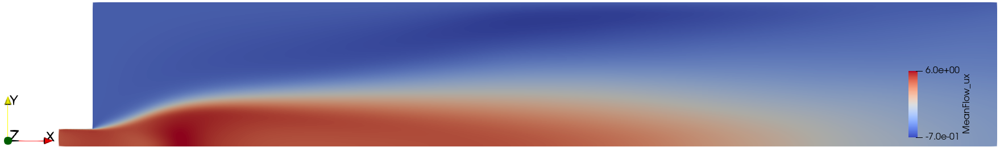
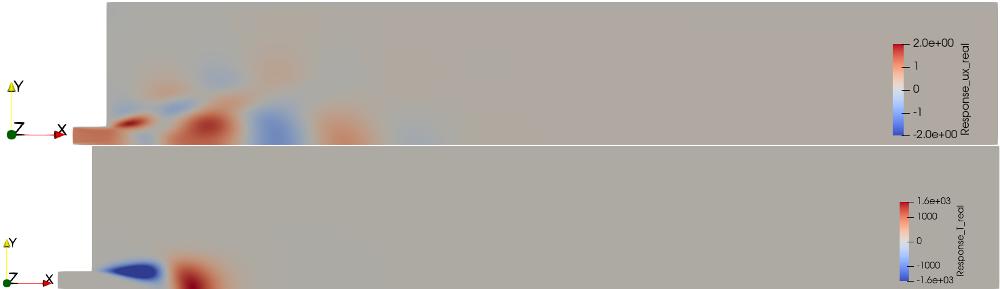

# Tutorial 4: Input/Output analysis

## Goal of the Tutorial
The goal of this tutorial is to provide a step-by-step guide on performing input/output analysis for a reacting turbulent jet. By the end of this tutorial, you will be able to:

- Configure reaction mechanisms and species transport in FELiCS.
- Write custom boundary conditions.
- Perform input/output analysis with boundary forcing for reactive flows using the mass, momentum and species equations and supplementary algebraic equations.

The analysis provides insights into:
- How the reacting flow responds to external perturbations
- The coupling between fluid dynamics and chemical reactions

The input/output analysis will:
1. Load the reacting flame base flow
2. Set up the linearized equations for momentum, mass, and species
3. Apply forcing at the specified boundary
4. Solve for the system response and compute transfer functions
6. Export results to the output directory

## Case Definition
In this tutorial, we will perform a compressible input/output analysis about a 2D reacting turbulent jet flame base flow. The analysis focuses on understanding how the system responds to a given boundary forcing. The axial component of the velocity $u_x$ is harmonically forced at the inlet. The linearized approach is built on several simplifications. The case uses a progress variable approach to model the reaction. A low-Mach approach is used, meaning density variations occur due to thermal expansion, but not due to pressure fluctuations. Furthermore, gas properties are assumed to be constant. Using these simplifications, the temperature of the gas can be directly linked to the progress variable using the perfect gas law. A detailed description of the numerical set up is found in Kaiser et al. [1].

The 3D configuration is purely axisymmetric, reducing the case to a 2D problem on a 2D mesh.

### Mesh generation
We generate the 2D mesh on GMSH for the combustor geometry. The mesh file `KITBurnerWallSep.msh` is used in this tutorial, which represents a confined burner configuration.

```{caution}
For 2D computations, FELiCS handles triangular elements only.
```

The mesh should include proper boundary identification for:
- Inlet boundaries (for fuel/air injection)
- Outlet boundaries (for gas outflow)
- Wall boundaries (no-slip conditions)
- Symmetry axis (for axisymmetric cases)

### Base Flow
This tutorial case folder is located in ```felics2.0/tutorials/input_ouput_tutorial```.

Our base flow is a time-averaged reacting flow field that includes:
- Velocity components ($u_x, u_r, u_\theta$)
- Pressure field $p$
- Species concentration (progress variable $c$)
- Temperature field $T$ (derived from progress variable)
- Turbulent viscosity field $\nu_t$

The base flow is stored in the file ```KIT_confined.fel```. This flow field represents the steady-state solution of the mean reacting flow equations and serves as the base state around which we perform the input/output analysis. The base flow axial velocity is displayed in [Figure 1](#UXMean) 
 <a id="fig:UXMean"></a>

Figure 1. Mean flow velocity $\bar{u}_x$

## Input/Output Analysis Parameters

### Boundary conditions
Here we set the axisymmetric boundary conditions in the [```boundaries.json```](../../tutorials/input_ouput_tutorial/boundaries.json) file.

The boundary conditions for reacting flows include additional considerations for species transport (here the progress $c'$):
| Boundary Type | ID | $u'_x$ | $u'_r$ | $u'_\theta$ | $p'$ | $c'$ |
|:---------------------|:---|:-----------|:-----------|:-----------|:-----------|:-----------|
| <span style="color:Darkorange">Forcing</span>   | 1         | None      | Dirichlet | Dirichlet | None      | Dirichlet  |
| <span style="color:Darkorange">Outlet</span>    | 2         | None      | None      | None      | Dirichlet | None       |
| <span style="color:Darkorange">Symmetry</span>  | 3         | Neumann   | Dirichlet | Neumann   | Neumann   | Neumann    |
| <span style="color:Darkorange">Walls</span>     | 4, 5, 6   | Dirichlet | Dirichlet | Dirichlet | Neumann   | Neumann    |

```{note}
The forcing boundary (Boundary 1) is where external perturbations are applied to study the system's response. The progress variable boundary conditions ensure proper species transport at each boundary.
```
Note that we set the name to `custom` in [```boundaries.json```](../../tutorials/input_ouput_tutorial/boundaries.json) to manually design each component of the BC.
```json
{
    "1": {
        "name": "custom",
        "specifics": [
            {
                "variable": "ux",
                "type": "None",
                "value": 0.0
            },
            {
                "variable": "ur",
                "type": "Dirichlet",
                "value": 0.0
            },
            {
                "variable": "ut",
                "type": "Dirichlet",
                "value": 0.0
            },
            {
                "variable": "p",
                "type": "None",
                "value": 0.0
            },
            {
                "variable": "progress",
                "type": "Dirichlet",
                "value": 0.0
            }
        ]
    },
}
```

### Reaction Mechanism
The reaction mechanism is defined in the [```mixture.json```](../../tutorials/input_ouput_tutorial/mixture.json) file. 
For this tutorial, we use a Schmidt number
```json
{"Sc":0.9}
```
and use the implemented flame model
```json
{"type": "KaiserCnF2023"}
```

### Settings
The setting file [```input_output.json```](../../tutorials/input_ouput_tutorial/input_ouput_tutorial.json) encapsulates the analysis information. The explanation of each field is provided in [Setting files](./../Running_FELiCS/FELiCS_settings.md).

Here are some key settings for input/output analysis with reacting flows:

- The coordinates system is set to Cylindrical with azimuthal wavenumber m=0 (axisymmetric mode) on our 2D mesh:
```json
"CoordinateSystem": "Cylindrical",
"m": 0.0,
"nDim": 2
```
- We enable input/output analysis with
```json
"AnalysisMode": "Input-Output",
```
- We include the `Momentum`, `Mass`, `Energy` equations, along with `Species` transport for progress variable. The `low-Mach` equation of state allows to assume the mean pressure to be constant. The density is only impacted by the temperature.
```json
"SetOfEquations": {
    "Momentum": {
        "Equation": "NSPrimitive",
        "Variable": "u"
    },
    "Mass": {
        "Equation": "Continuity",
        "Variable": "p"
    },
    "Species": {
        "Equation": "Non-conservative",
        "Variable": "progress"
    },
    "Energy": {
        "Equation": "ProgressVariableLinear",
        "Variable": "None"
    },
    "EquationOfState": {
        "Equation": "Low-Mach",
        "Variable": "None"
    }
}
```

- The Prandtl number is defined for thermal diffusion and the eddy viscosity $\nu_t$ is read from the **.fel** file.
```json
"PrandtlNumber": 0.9,
"TurbulenceModel": "File"
```
- The boundary forcing is applied at boundary index 1 and is applied on the axial velocity component (index 0). It is a harmonic forcing with frequency $\omega = 314$ Hz. 
```json
"IOResolvent": {
    "ForcingBoundaryIndices": [1],
    "ForcingCoeff": [0],
    "ForcingMode": "Boundary",
    "Omegas": [314]
}
```
- The mixture file provides the reaction mechanism
```json
"MixtureFilePath": "mixture.json"
```

## Running the analysis
Run the analysis with the command:
```bash
FELiCS -f input_output.json
```

## Postprocessing
Inside the ```output_dir``` directory, all the response modes can be found in the ```.h5``` and ```.xmf``` format, along with the amplification gains in ```gains.csv```.

Open the ```.xmf``` file in Paraview. There you can visualize all the base flow variables and response modes. For instance [Figure 2](#UXT) plots the real part of $u_x'$ and $T'$. 
 <a id="fig:UXT"></a>

Figure 2. Real part of the response modes $u_x'$ and $T'$.

## References
<a id="1">[1]</a> Kaiser T.L., Varillon G., Polifke W., Zhang F., & Zirwes T., Bockhorn H., Oberleithner, K. “Modelling the response of a turbulent jet flame to acoustic forcing in a linearized framework using an active flame approach”. In: Combustion and Flame 253 (2023). doi: 10.1016/j.combustflame.2023.112778.
