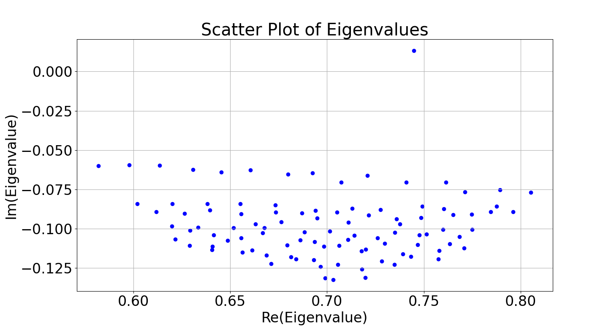
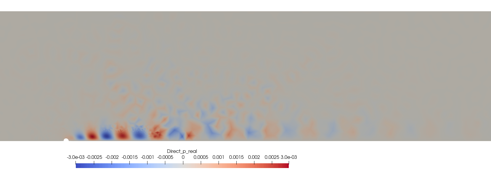

# Tutorial 2: Modal Analysis

## Goals of the tutorial
In this tutorial, we will do an eigenvalue decomposition of the base flow obtained in the tutorial of [cylinder wake](./cylinder_wake.md). By the end of this tutorial, you will be able to:

- Define the boundary conditions.
- Run a linear stability analysis case.
- Postprocess modal analysis results with paraview.

The linear stability analysis provides insights into:
- The growth or decay rates of small perturbations superimposed on the base flow.
- The dominant spatial structures (modes) associated with flow instabilities.

The modal analysis will:
1. Identify which flow structures are most likely to become unstable.
2. Quantify the stability characteristics by computing eigenvalues and corresponding eigenmodes.

## Requirements
Before you begin this tutorial make sure to:
* have completed the [base flow tutorial](./cylinder_wake.md).
* access the case folder ```felics/tutorials/modal_analysis_tutorial``` and copy it into your working directory.

## Modal analysis settings

### Boundary conditions
The boundary conditions for the fluctuations are:

| Boundary | ID | $u'_x$     | $u'_y$      | $p'$       |
|:----------|:--:|:-----------|:-----------|:-----------|
| <code style="color : Darkorange">Inlet</code>    | 1 | Dirichlet | Dirichlet | Dirichlet   |
| <code style="color : Darkorange">Symmetry</code> | 2 | Dirichlet   | Neumann | Dirichlet   |
| <code style="color : Darkorange">Outlet</code>   | 3 | Dirichlet   | Dirichlet   | Dirichlet |
| <code style="color : Darkorange">Top</code>      | 4 | Dirichlet   | Dirichlet | Dirichlet   |
| <code style="color : Darkorange">Wall</code>     | 5 | Dirichlet | Dirichlet | Neumann   |

```{note}
The BCs for the base flow variables ($\bar{u}_x, \bar{u}_y, \bar{p}$) in [base flow tutorial](./cylinder_wake.md) and for the perturbations ($u_x', u_y', p'$) current modal analysis are different.
```

These BCs are implemented in [```bc_modal.json```](./../../tutorials/modal_analysis_tutorial/bc_modal.json) using different names.

When all BCs are set to Dirichlet with a value 0 (always the case for fluctuations), we set: 
```json
    "1": {
        "name": "zeroDirichlet"
    },
``` 
We impose this for ```Inlet, Outlet, Top```.
To impose a symmetric boundary condition we specify the BC for every variable:
```json
    "2":{
        "name": "symmetry",
        "specifics": [
        {
            "type": "Dirichlet",
            "value": 0.0,
            "variable": "ux"
        },
        {
            "type": "Neumann",
            "value": 0.0,
            "variable": "uy"
        },
        {
            "type": "Dirichlet",
            "value": 0.0,
            "variable": "p"
        }
        ]
    },
```
The wall BC is imposed with: 
```json
    "5":{
        "name": "wall"
    }
``` 
The complete structure of this file is detailed in the [boundary-condition file documentation](./../Running_FELiCS/input_files/bc_files.md).

### Settings
The setting file, [```modal.json```](./../../tutorials/modal_analysis_tutorial/modal.json) contains all the information relevant for modal analysis. The detailed structure of [```modal.json```](./../../tutorials/modal_analysis_tutorial/modal.json) can be found inside the [FELiCS configuration file documentation](./../Running_FELiCS/input_files/param_files.md).

Here are some key settings for our resolvent analysis:

- The spanwise wavenumber is set to 0:
```json
{"m": 0.0,}
```
- We specify the spatial domain dimension in the settings file as 2D:
```json
{"nDim": 2}
```
- The coordinate system is set to Cartesian:
```json
{"CoordinateSystem": "Cartesian"}
```

- We include the mesh file [```cylinder_wake.msh```](./../../tutorials/cylinder_wake_tutorial/cylinder_wake.msh), the base flow file [```base_flow_for_FELiCS.fel```](./../../tutorials/modal_analysis_tutorial/base_flow_for_FELiCS.fel) generated in the [base flow tutorial](./cylinder_wake.md) and the BCs file [```bc_modal.json```](./../../tutorials/modal_analysis_tutorial/bc_modal.json) with these references:
```json
{"MeshFilePath":"cylinder_wake.msh"}
{"MeanFlowFilePath": "base_flow_for_FELiCS.fel"}
{"BCsFilePath": "bc_modal.json"}
```
- We specify which eigenvalues to compute by providing a list of initial guesses:
```json
{"EigenValueGuess": [0.7]}
```
- For each guess, the number of eigenvalues to be calculated closest to that value is set to:
```json
{"nSolut": 100}
```
## Running the analysis
Run the modal analysis via 
```sh
FELiCS -f modal.json
```
## Postprocessing
After running the modal analysis, the working directory should look like:
```bash
.
└── logs
└── output_dir
├ base_flow_for_FELiCS.fel
├ bc_modal.json
├ cylinder_wake.msh
├ modal.json
├ PlotScatter.py
└ ...
```
Inside the ```output_dir``` directory, all the eigenmodes in ```.h5``` and ```.xmf``` format can be found, along with the eigenvalues in ```spectrum.csv``` file. 
Run the pyhton script [PlotScatter.py](./../../tutorials/modal_analysis_tutorial/PlotScatter.py) to plot the computed eigenvalue spectrum:
 <a id="fig:EigSpec"></a>
Figure 1. Eigenspectrum

In [Figure 1](#EigSpec), an eigenvalue with a positive imaginary part stands out. We use paraview to visualize the corresponding real part of the eigenmode stored in `Mode_Modal_Direct_Omega_0.745+0.013j.xmf`. 

 <a id="fig:RealUx"></a>
Figure 2. Real eigenmode, $u'_x$

 <a id="fig:RealUy"></a>
Figure 3. Real eigenmode, $u'_y$

 <a id="fig:Realp"></a>
Figure 4. Real eigenmode, $p'$
